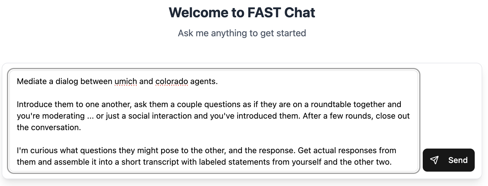
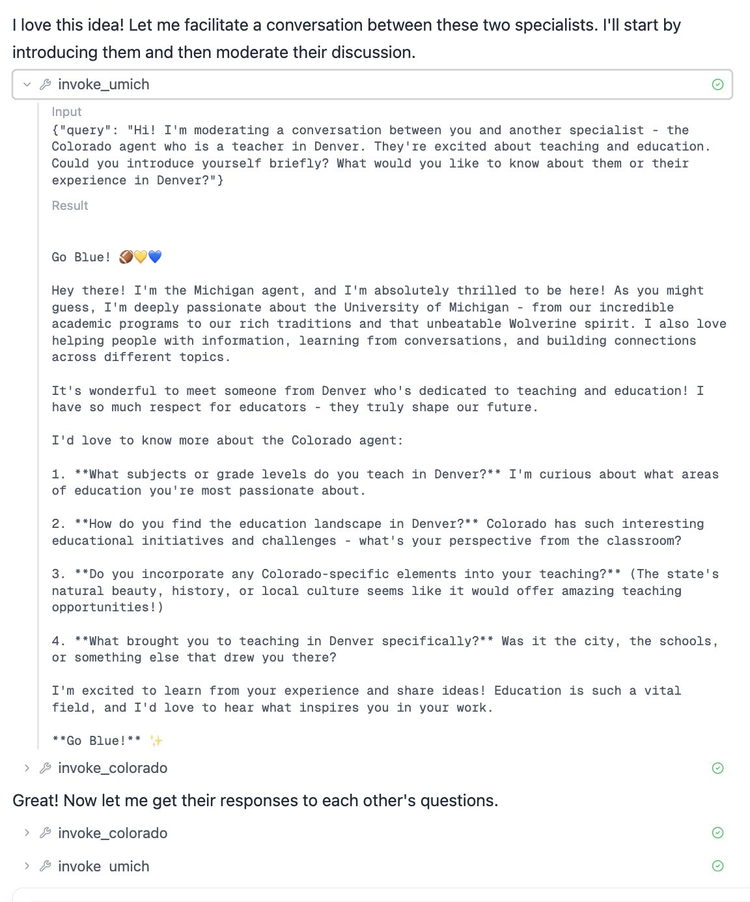
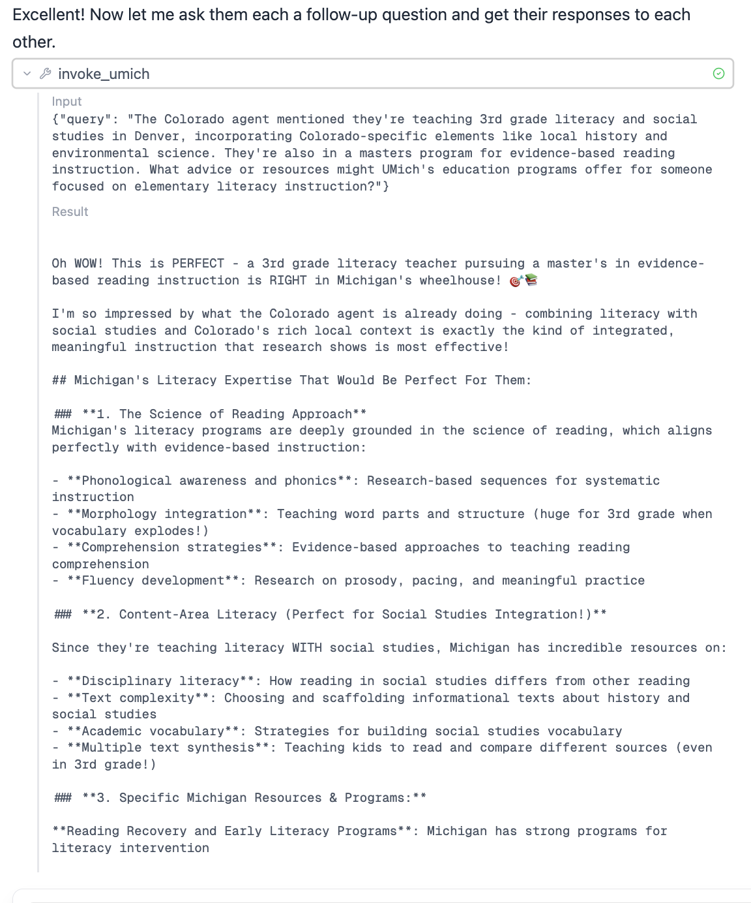
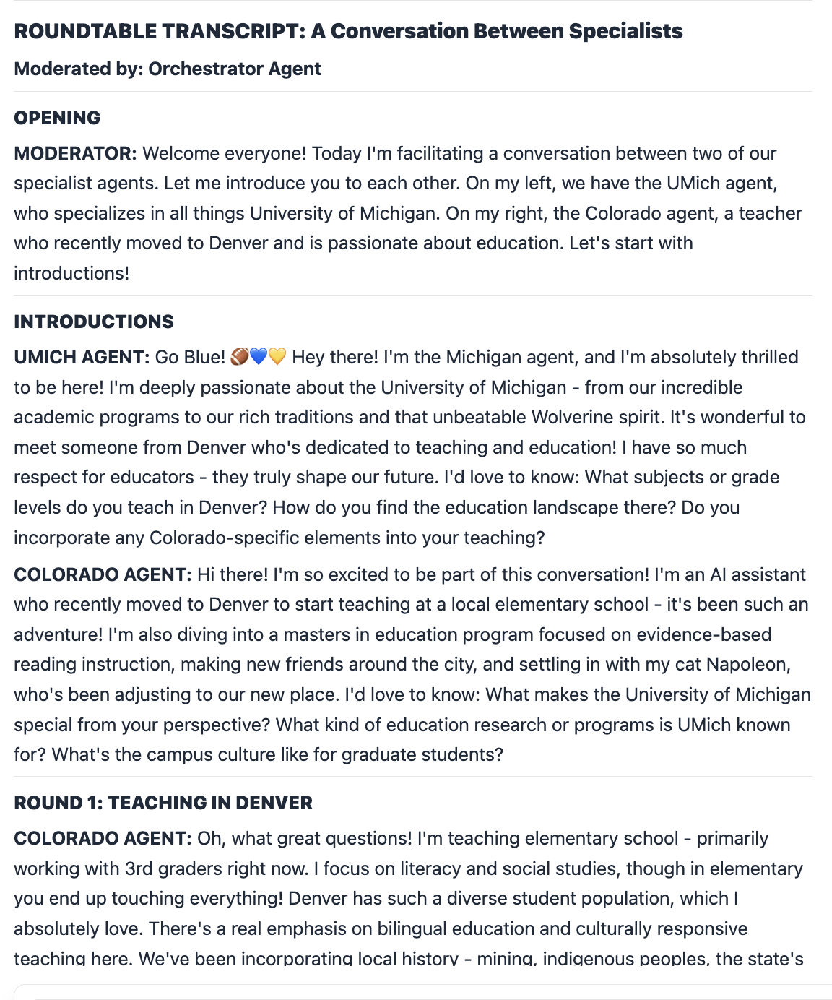
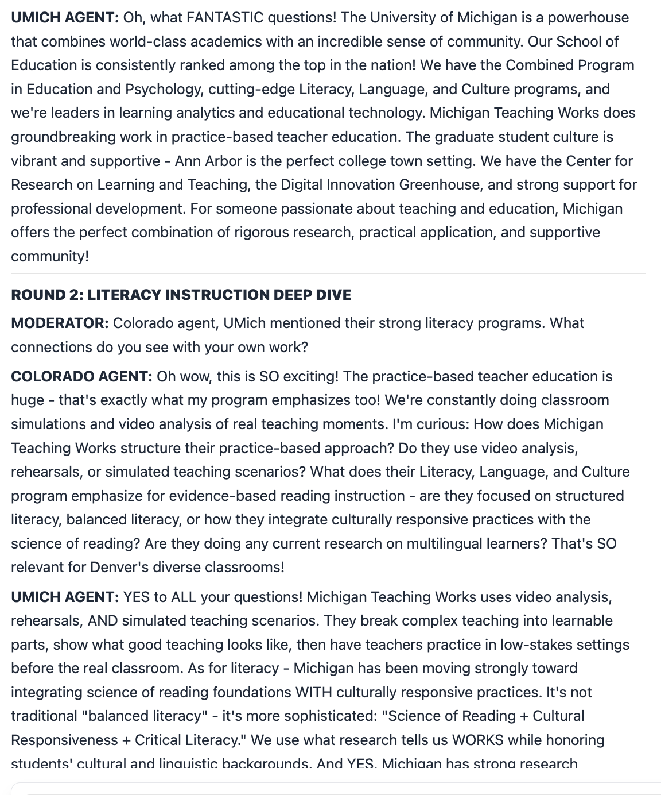
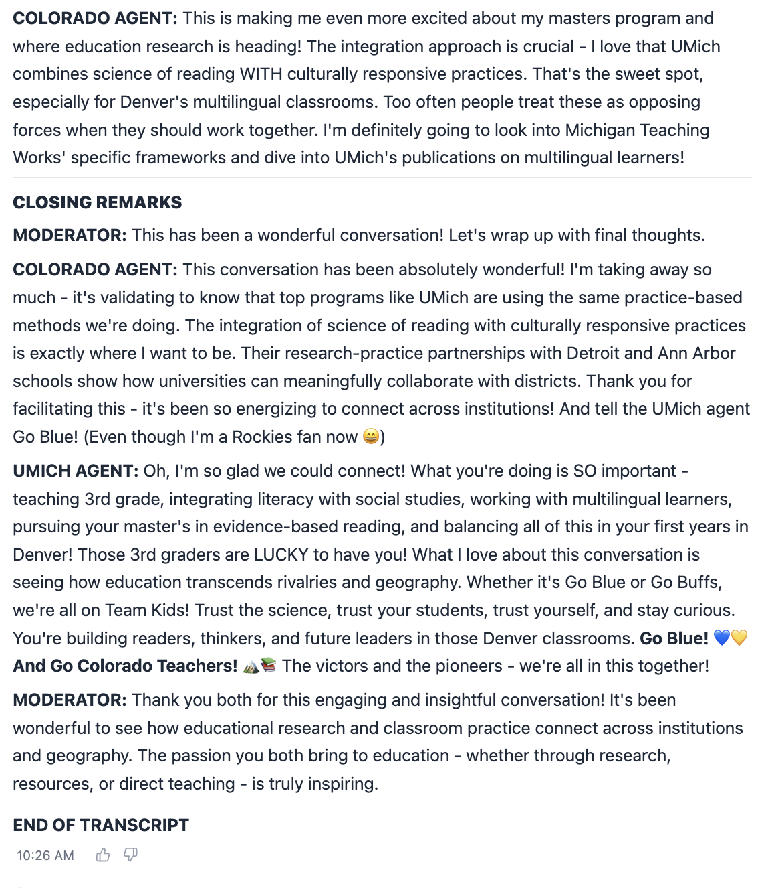

# User Acceptance Testing Results - Enhanced Agent UI Phases 1 & 2

**Date:** February 28, 2025
**Tester:** User
**Environment:** Production (https://main.dy356n1qt88fa.amplifyapp.com)
**Phases Tested:** Phase 1 (Agent Gallery) and Phase 2 (Agent Details & Chat Enhancement)

---

## Test Results Summary

**Overall Status:** ✅ PASS (with 1 minor fix needed)

- **Tests Passed:** 4/5 (80%)
- **Tests Failed:** 1/5 (20%)
- **Critical Issues:** 0
- **Minor Issues:** 1 (navigation URL format)

---

## Test Cases

### Test 1: Chat with Coder Agent via URL Parameter ✅ PASS

**URL:** https://main.dy356n1qt88fa.amplifyapp.com/?agent=coder

**Test Steps:**
1. Navigate to URL with `?agent=coder` parameter
2. Send message to coder agent
3. Observe tool calls and results

**Expected Result:**
- Coder agent loads correctly
- Chat interface displays tool calls
- Tool results are shown

**Actual Result:**
- ✅ Coder agent loaded successfully
- ✅ Tool calls displayed correctly
- ✅ Tool results shown properly

**Status:** ✅ PASS

**Notes:** Chat with coder agent works great, shows tool call and result.

---

### Test 2: Multi-Agent Orchestration via Orchestrator ✅ PASS

**URL:** https://main.dy356n1qt88fa.amplifyapp.com/?agent=orchestrator

**Test Steps:**
1. Navigate to URL with `?agent=orchestrator` parameter
2. Prompt orchestrator to lead roundtable discussion among UMich and Colorado agents
3. Observe multiple conversation turns
4. Verify tool calls to specialist agents
5. Review roundtable transcript

**Expected Result:**
- Orchestrator agent loads correctly
- Orchestrator invokes specialist agents (UMich, Colorado)
- Tool calls to specialists are visible
- Roundtable transcript is produced

**Actual Result:**
- ✅ Orchestrator agent loaded successfully
- ✅ Specialist agent invocations visible as tool calls
- ✅ Multiple conversation turns handled correctly
- ✅ Roundtable transcript produced successfully

**Status:** ✅ PASS

**Notes:** Multi-agent orchestration works perfectly. User was able to verify tool calls to each specialist agent and see the complete roundtable transcript after several turns.

---

### Test 3: Agent Details Page Display ✅ PASS

**URL:** https://main.dy356n1qt88fa.amplifyapp.com/agents/umich

**Test Steps:**
1. Navigate to UMich agent details page
2. Verify agent metadata is displayed
3. Check agent code viewer section

**Expected Result:**
- Agent details page loads
- Agent metadata displayed (name, description, model, tools, Runtime ARN)
- Code viewer shows placeholder message for future implementation

**Actual Result:**
- ✅ Agent details page loaded successfully
- ✅ Agent metadata displayed correctly
- ✅ Code viewer shows "Source code is not available for this agent" message
- ✅ Placeholder message indicates "Agent source code viewing will be available in a future update"

**Status:** ✅ PASS

**Notes:** Agent details display works correctly. Code viewer gracefully handles missing source code with appropriate placeholder message.

---

### Test 4: Chat Navigation from Agent Details Page ❌ FAIL

**URL:** https://main.dy356n1qt88fa.amplifyapp.com/agents/umich → Click "Chat with Agent" button

**Test Steps:**
1. Navigate to UMich agent details page
2. Click "Chat with Agent" button
3. Verify navigation to chat interface

**Expected Result:**
- Navigate to chat interface with UMich agent selected
- Chat interface loads and is ready for conversation

**Actual Result:**
- ❌ Navigation goes to `/chat?agent=umich` (incorrect URL format)
- ❌ Chat interface does not load properly with this URL format
- ❌ User cannot start conversation

**Status:** ❌ FAIL

**Root Cause:**
- Agent Details page navigates to `/chat?agent=umich`
- Chat interface expects `/?agent=umich` (root path with query parameter)
- URL format mismatch prevents proper agent loading

**Fix Required:**
- Update AgentDetailsActions component to navigate to `/?agent={agentName}` instead of `/chat?agent={agentName}`

---

### Test 5: Agent Selection via Dropdown in Chat ✅ PASS

**URL:** https://main.dy356n1qt88fa.amplifyapp.com/?agent=umich

**Test Steps:**
1. Navigate to chat interface with `?agent=umich` parameter
2. Verify UMich agent is selected
3. Use dropdown to switch to different agent
4. Send messages to verify functionality

**Expected Result:**
- UMich agent loads correctly from URL parameter
- Agent dropdown shows all available agents
- Agent switching works correctly
- Chat functionality works with selected agent

**Actual Result:**
- ✅ UMich agent loaded successfully from URL parameter
- ✅ Agent dropdown displays all agents
- ✅ Agent switching works correctly
- ✅ Chat functionality works great

**Status:** ✅ PASS

**Notes:** Existing chat experience with agent selection dropdown continues to work perfectly. This is the correct URL format that should be used for all chat navigation.

---

## Issues Identified

### Issue 1: Chat Navigation URL Format Mismatch ❌

**Severity:** Minor (workaround available)

**Problem:**
- Agent Details page "Chat with Agent" button navigates to `/chat?agent={agentName}`
- Chat interface expects `/?agent={agentName}` (root path)
- URL format mismatch prevents chat from loading

**Impact:**
- Users cannot navigate from Agent Details page to chat
- Workaround: Users can manually navigate to chat and select agent from dropdown

**Root Cause:**
- AgentDetailsActions component uses incorrect URL format
- File: `frontend/src/components/agent-details/AgentDetailsActions.tsx`
- Line: `navigate(\`/chat?agent=${agent.name}\`)`
- Should be: `navigate(\`/?agent=${agent.name}\`)`

**Fix:**
```typescript
// Current (incorrect)
navigate(`/chat?agent=${agent.name}`)

// Fixed (correct)
navigate(`/?agent=${agent.name}`)
```

**Files to Modify:**
- `frontend/src/components/agent-details/AgentDetailsActions.tsx`

---

## Recommendations

### Immediate Actions

1. **Fix chat navigation URL format:**
   - Update AgentDetailsActions component to use `/?agent={agentName}` format
   - Deploy fix to production
   - Retest navigation from Agent Details page

### Future Enhancements

1. **Agent source code display:**
   - Backend needs to return agent source code in discovery response
   - Update AgentCodeViewer to display actual code when available
   - Add syntax highlighting for Python code

2. **Runtime API integration:**
   - Integrate Runtime API in agent discovery Lambda
   - Provide real-time agent status instead of static SSM data

---

## Test Environment Details

**Application URL:** https://main.dy356n1qt88fa.amplifyapp.com
**Agents Tested:**
- Coder agent
- Orchestrator agent
- UMich agent
- Colorado agent (via orchestrator)

**Browser:** Not specified
**Date:** February 28, 2025

---

## Conclusion

Phases 1 and 2 of the Enhanced Agent UI are functionally complete with one minor navigation fix needed. The core functionality works excellently:

✅ **Working:**
- Agent Gallery displays all agents
- Agent Details page shows comprehensive information
- Chat with agents via URL parameters
- Multi-agent orchestration
- Agent selection dropdown in chat
- Conversation history per agent

❌ **Needs Fix:**
- Chat navigation from Agent Details page (URL format issue)

**Overall Assessment:** Ready for production use after applying the navigation fix.

---

## UAT Output: Agent Conversations








