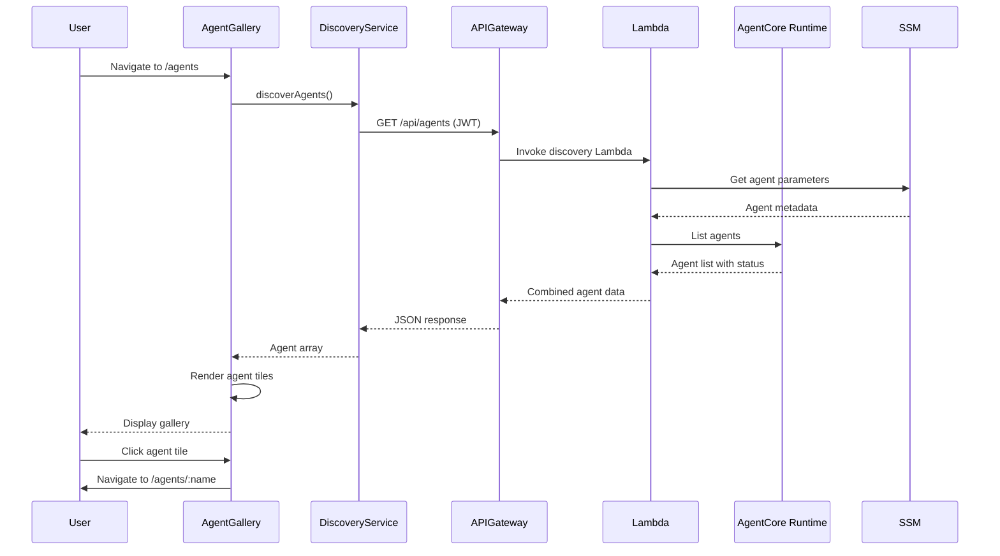
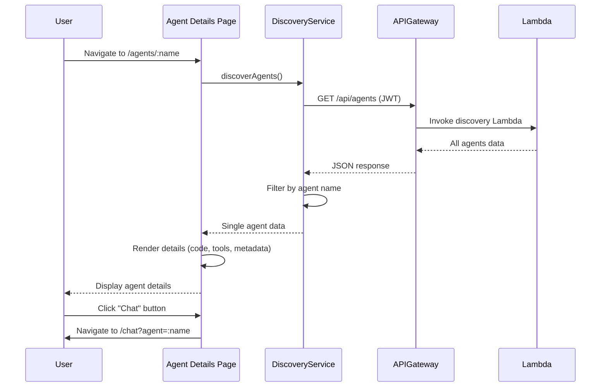
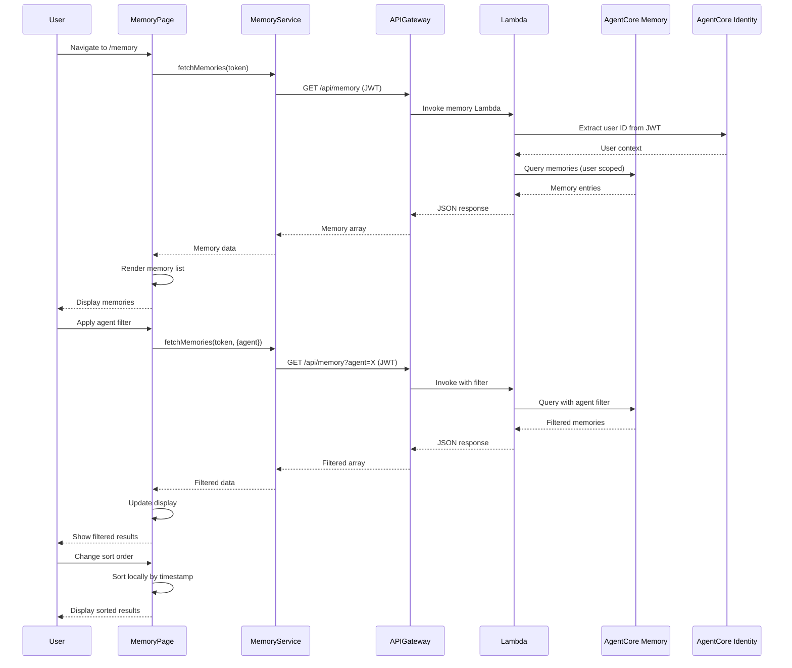
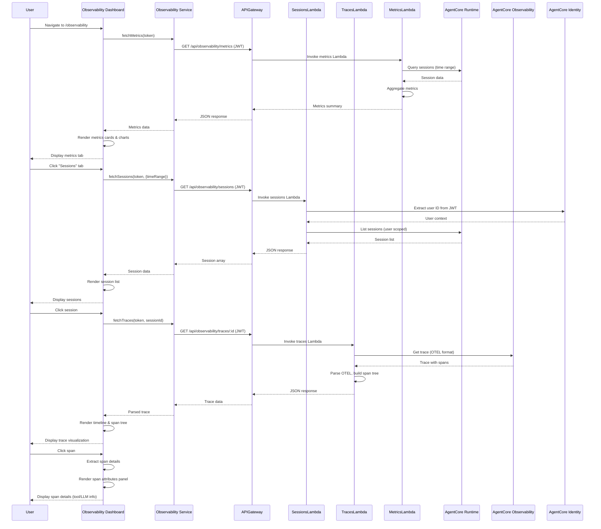
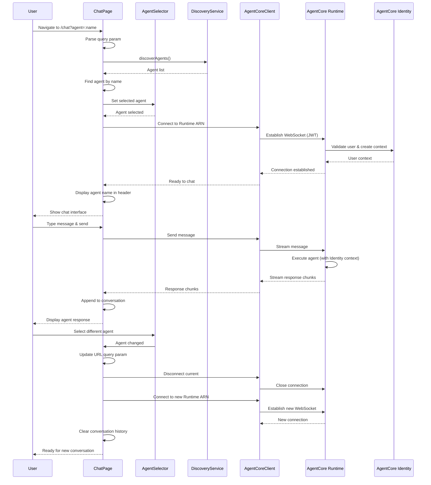
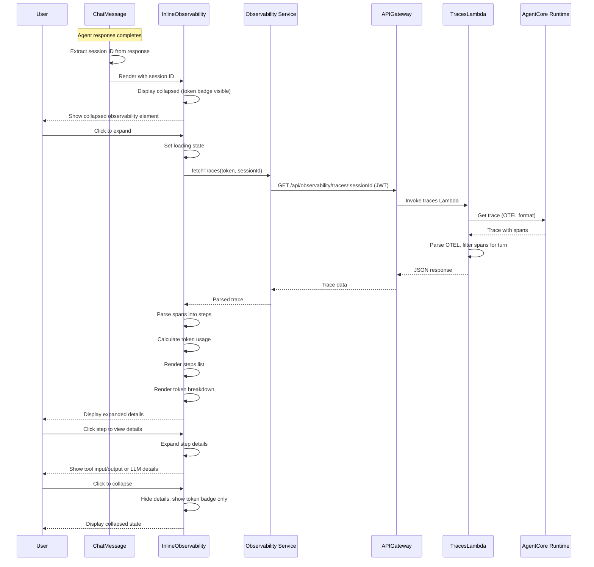

# Design Document: Enhanced Agent UI

## Overview

The Enhanced Agent UI transforms the current single-agent chat interface into a comprehensive multi-agent management and observability platform. This feature enables users to discover, inspect, and interact with multiple agents deployed on AgentCore Runtime, while providing visibility into agent memory, session logs, traces, and performance metrics.

### Goals

- Provide a visual gallery for discovering and selecting agents
- Enable detailed inspection of agent configurations and code
- Support direct agent chat initiation without orchestrator mediation
- Visualize long-term memory stored by agents
- Display comprehensive observability data including sessions, traces, and spans
- Maintain existing authentication and security patterns
- Follow established FAST architecture patterns

### Non-Goals

- Real-time agent deployment or code editing
- Agent creation or modification through the UI
- Custom dashboard creation or metric configuration
- Integration with external observability platforms

## Design Principles

### Documentation-Driven Development

This feature integrates new Strands and AgentCore functionality that requires careful alignment with established patterns and best practices. The implementation must follow a documentation-discovery approach:

**Documentation Sources:**
- Strands documentation (patterns, conventions, best practices)
- AgentCore component documentation (Memory, Gateway, Identity, Observability, Code Interpreter)
- Existing code examples in the FAST repository
- AWS Bedrock AgentCore API documentation

**Implementation Approach:**
1. **Discovery Phase:** Before implementing each component, identify and review relevant documentation
2. **Validation Phase:** Verify that the proposed approach aligns with documented patterns
3. **Clarification Phase:** When documentation is unclear or conflicting, prompt the user for guidance
4. **Alignment Phase:** Ensure implementation follows established conventions from both Strands and AgentCore

**Task-Level Documentation Requirements:**
- Each task in tasks.md should include sub-tasks for documentation discovery
- Sub-tasks should identify which documentation sources are relevant
- Sub-tasks should validate alignment with Strands patterns (e.g., agent structure, tool integration)
- Sub-tasks should validate alignment with AgentCore patterns (e.g., Memory API usage, Identity integration)
- Kiro should gather documentation context before writing code
- When patterns are ambiguous, Kiro should present options to the user for alignment

**Why This Matters:**
- Strands provides opinionated patterns for agent development that must be followed
- AgentCore components have specific integration requirements and best practices
- This feature adds new AgentCore components (Identity, Observability) not previously used
- Consistency with existing patterns ensures maintainability and reduces technical debt
- Documentation-first approach reduces implementation errors and rework

## Architecture

### High-Level Architecture

The Enhanced Agent UI follows FAST's established three-tier architecture:

```
┌─────────────────────────────────────────────────────────────┐
│              Frontend (React + Vite via Amplify)             │
│  ┌──────────────┐  ┌──────────────┐  ┌──────────────┐      │
│  │ Agent Gallery│  │   Memory     │  │ Observability│      │
│  │    Page      │  │   Page       │  │  Dashboard   │      │
│  └──────────────┘  └──────────────┘  └──────────────┘      │
│  ┌──────────────┐  ┌──────────────┐                        │
│  │ Agent Details│  │  Chat Page   │                        │
│  │    Page      │  │  (Enhanced)  │                        │
│  └──────────────┘  └──────────────┘                        │
└─────────────────────────────────────────────────────────────┘
                            │
                            │ HTTPS + JWT
                            ▼
┌─────────────────────────────────────────────────────────────┐
│              API Gateway + Lambda Functions                  │
│  ┌──────────────┐  ┌──────────────┐  ┌──────────────┐      │
│  │   /agents    │  │   /memory    │  │/observability│      │
│  │  (existing)  │  │    (new)     │  │    (new)     │      │
│  └──────────────┘  └──────────────┘  └──────────────┘      │
└─────────────────────────────────────────────────────────────┘
                            │
                            │ AWS SDK
                            ▼
┌─────────────────────────────────────────────────────────────┐
│                    AWS Services Layer                        │
│  ┌──────────────┐  ┌──────────────┐  ┌──────────────┐      │
│  │     SSM      │  │  AgentCore   │  │  AgentCore   │      │
│  │  Parameters  │  │   Components │  │   Runtime    │      │
│  └──────────────┘  └──────────────┘  └──────────────┘      │
└─────────────────────────────────────────────────────────────┘
```

**Important Deployment Note:**
- Frontend is deployed via AWS Amplify (not served by API Gateway or CloudFront)
- API Gateway is used ONLY for backend API endpoints (/agents, /memory, /observability)
- This design maintains the existing Amplify deployment pattern

### Technology Stack

**Frontend:**
- React 18 with TypeScript
- Vite for build tooling
- shadcn/ui component library
- Tailwind CSS 4 for styling
- Lucide React for icons
- React Router for navigation

**Backend:**
- AWS API Gateway (REST API)
- AWS Lambda (Python 3.13)
- AWS Lambda Powertools for Python
- Cognito User Pools for authentication

**Infrastructure:**
- AWS CDK (TypeScript)
- CloudFormation for deployment
- SSM Parameter Store for configuration
- CloudWatch for logging

**AWS Services:**
- AgentCore Runtime (agent execution)
- AgentCore Memory (long-term storage)
- Cognito (authentication/authorization)

### AgentCore Component Integration

This feature integrates with multiple AgentCore components. Understanding which components are used where is critical for proper implementation.

**IMPORTANT:** See `.kiro/steering/agentcore-architecture.md` for detailed component definitions and common misconceptions to avoid.

**Currently Used Components:**

1. **AgentCore Runtime**
   - Used by: All agent executions, chat interface, observability APIs
   - Purpose: Executes agent code, manages sessions, generates traces in OTEL format
   - Integration: Direct connection via agentcore-client library (frontend), AWS SDK (backend)
   - Location: Existing integration in chat page and backend
   - Key APIs: InvokeAgent, ListSessions, GetSession, GetTrace

2. **AgentCore Memory**
   - Used by: Agents (automatic), memory page, memory API Lambda
   - Purpose: Stores and retrieves long-term memories across sessions
   - Integration: AWS SDK for Bedrock (backend only for UI display)
   - Location: Already deployed in backend-stack.ts, new Lambda for UI access
   - Memory Strategies: SummaryMemoryStrategy, UserPreferenceMemoryStrategy, SemanticMemoryStrategy
   - **VALIDATION REQUIRED:** Response schemas differ per memory strategy - must validate against AgentCore docs

3. **AgentCore Gateway**
   - Used by: Agents (for tool execution)
   - Purpose: Routes tool execution requests, manages tool authentication
   - Integration: Called by agent code, not directly by UI
   - Location: Existing in backend-stack.ts
   - **CRITICAL CLARIFICATION:** Gateway is a TOOLS gateway, NOT an agent gateway or registry
   - Common Misconception: ❌ Gateway does NOT manage agent discovery

4. **AgentCore Code Interpreter**
   - Used by: Agents that need code execution capabilities
   - Purpose: Executes Python code in sandboxed environment
   - Integration: Called as a tool by agents via IAM permissions
   - Location: IAM permissions in backend-stack.ts (lines 340-353)
   - **CRITICAL CLARIFICATION:** No separate resource creation needed - it's a managed service

**Components NOT in This Spec (Future Work):**

5. **AgentCore Identity**
   - Status: NOT YET IMPLEMENTED in this codebase
   - Purpose: User identity and context management, external credential handling
   - Current State: Session ID, user ID, agent ID handled by Runtime itself
   - Future Use: Fine-grained authorization, external service credentials
   - Note: Will be addressed in future security enhancement spec

6. **AgentCore Observability**
   - Status: VALIDATION REQUIRED
   - Purpose: Structured access to traces, spans, and metrics
   - **QUESTION:** Are traces retrieved via Observability API or CloudWatch Logs API?
   - Current Understanding: Runtime emits logs to CloudWatch in OTEL format
   - Need to Confirm: Which API to use for trace retrieval
   - Implementation Priority: HIGH - Core feature requirement

**Component Integration Map (CORRECTED):**

```
Frontend Pages          Backend APIs           AgentCore Components
─────────────────────────────────────────────────────────────────
Agent Gallery    ──────> /agents         ──────> Runtime (list agents API)
                                         ──────> SSM (agent metadata)

Agent Details    ──────> /agents         ──────> Runtime (agent metadata)
                                         ──────> SSM (additional config)

Chat Page        ──────> Direct WS       ──────> Runtime (execution, session mgmt)
                                         ──────> Memory (auto-used by agents)
                                         ──────> Gateway (tool execution)
                                         ──────> Code Interpreter (via agent)

Memory Page      ──────> /memory         ──────> Memory (retrieve records)

Observability    ──────> /observability  ──────> Runtime (session metadata)
Dashboard                                ──────> CloudWatch Logs (OTEL traces)
                                                 OR Observability API (TBD)
```

**Integration Requirements:**

- **Runtime Integration:** Use Runtime API for agent listing and session queries
- **Memory Integration:** Memory queries scoped by user ID from JWT token
- **Gateway Integration:** NOT used for agent discovery - only for tool execution by agents
- **SSM Integration:** Hybrid approach - SSM stores agent metadata, Runtime provides status
- **Observability Integration:** Validate whether to use Observability API or CloudWatch Logs API

**Data Model Validation Requirements:**

**CRITICAL:** All backend Lambda implementations MUST include validation sub-tasks:
- Validate API response schemas against AgentCore documentation
- Confirm memory strategy schemas from CDK configuration
- Verify OTEL trace format structure from actual traces
- Test with real AgentCore responses (not mocked data)
- Do NOT guess response formats

## Components and Interfaces

### Frontend Components

#### 1. Agent Gallery Page (`/agents`)

**Purpose:** Display all available agents as interactive tiles

**Component Structure:**
```
AgentGalleryPage
├── AgentGalleryHeader (title, description)
├── AgentGalleryGrid
│   └── AgentTile[] (one per agent)
│       ├── AgentTileHeader (name, status badge)
│       ├── AgentTileDescription
│       ├── AgentTileMetadata (model, tools count)
│       └── AgentTileActions (view details button)
└── ErrorBoundary (error handling)
```

**Key Features:**
- Responsive grid layout (1 column mobile, 2-3 columns desktop)
- Status badges (deployed=green, failed=red, pending=yellow)
- Click tile to navigate to details page
- Loading states with skeleton components
- Error states with retry functionality

**Data Flow:**
1. Component mounts → call `discoverAgents()` service
2. Service fetches from `/api/agents` endpoint
3. Display agents in grid with status indicators
4. Handle click → navigate to `/agents/:agentName`

#### 2. Agent Details Page (`/agents/:agentName`)

**Purpose:** Display comprehensive agent information and enable chat initiation

**Component Structure:**
```
AgentDetailsPage
├── AgentDetailsHeader (name, status, back button)
├── AgentDetailsOverview
│   ├── DescriptionSection
│   ├── ModelSection
│   ├── ToolsSection (expandable list)
│   └── DeploymentSection (ARN, status)
├── AgentCodeViewer (syntax-highlighted Python)
├── AgentDetailsActions
│   └── ChatButton (disabled if status=failed)
└── ErrorBoundary
```

**Key Features:**
- Syntax highlighting for Python code using `react-syntax-highlighter`
- Expandable tools list with descriptions
- Copy-to-clipboard for ARN and code
- Disabled chat button for failed deployments
- Breadcrumb navigation

**Data Flow:**
1. Extract `agentName` from route params
2. Fetch agent details from existing `/api/agents` endpoint
3. Filter for specific agent by name
4. Display all metadata and code
5. Chat button → navigate to `/chat?agent=:agentName`


#### 3. Enhanced Chat Page (`/chat`)

**Purpose:** Support agent selection and direct agent communication with inline observability

**Component Structure:**
```
ChatPage (enhanced)
├── ChatHeader
│   ├── AgentSelector (dropdown, new)
│   └── SessionInfo (agent name, status)
├── ChatMessageList
│   └── ChatMessage[] (existing + enhanced)
│       ├── MessageContent
│       └── InlineObservability (new, collapsible)
│           ├── ObservabilityToggle (collapsed by default)
│           └── ObservabilityDetails (when expanded)
│               ├── StepsList
│               │   └── StepItem[]
│               │       ├── StepIcon (tool/LLM indicator)
│               │       ├── StepName
│               │       ├── StepDuration
│               │       └── StepStatus (success/error)
│               └── TokenUsageSummary
│                   ├── InputTokens
│                   └── OutputTokens
├── ChatInput (existing)
└── ErrorBoundary
```

**Key Features:**
- Agent selector dropdown in header
- Query parameter support: `/chat?agent=agentName`
- Maintain existing streaming functionality
- Display selected agent name prominently
- Switch agents without losing UI state (new session)
- **NEW:** Inline observability element below each agent message
- **NEW:** Collapsible observability details (collapsed by default)
- **NEW:** Real-time step tracking during agent response
- **NEW:** Token usage display per conversational turn

**Data Flow:**
1. Check URL query param for `agent` parameter
2. If present, select that agent; otherwise use default
3. Establish AgentCore Runtime connection to selected agent's ARN
4. Stream messages using existing `agentcore-client` library
5. Agent selector change → update URL and reconnect
6. **NEW:** For each agent response:
   - Capture session ID from Runtime response
   - Fetch trace data for that turn via `/api/observability/traces/:sessionId`
   - Parse spans to extract steps, tool calls, LLM invocations
   - Display in collapsible observability element
   - Calculate and display token usage summary

#### 3a. Inline Observability Component (Chat Page Enhancement)

**Purpose:** Display observability data directly within chat messages for real-time debugging

**Component Structure:**
```
InlineObservability
├── ObservabilityToggle
│   ├── ToggleButton (chevron icon)
│   ├── SummaryText ("View details" / "Hide details")
│   └── TokenBadge (total tokens, always visible)
├── ObservabilityDetails (conditional render when expanded)
│   ├── StepsSection
│   │   ├── SectionHeader ("Agent Steps")
│   │   └── StepsList
│   │       └── StepItem[]
│   │           ├── StepIcon (tool icon or brain icon for LLM)
│   │           ├── StepHeader
│   │           │   ├── StepName
│   │           │   └── StepDuration (ms)
│   │           ├── StepDetails (conditional)
│   │           │   ├── ToolInput (for tool calls)
│   │           │   ├── ToolOutput (for tool calls)
│   │           │   ├── ModelName (for LLM invocations)
│   │           │   └── TokenBreakdown (for LLM invocations)
│   │           └── StepStatus (success/error indicator)
│   └── TokenUsageSection
│       ├── SectionHeader ("Token Usage")
│       ├── InputTokensRow (count + label)
│       ├── OutputTokensRow (count + label)
│       └── TotalTokensRow (count + label)
└── ErrorState (if trace fetch fails)
```

**Key Features:**
- **Collapsed by default:** Minimizes visual clutter in chat
- **Toggle interaction:** Click to expand/collapse
- **Token badge always visible:** Shows total tokens even when collapsed
- **Chronological step display:** Steps ordered by start time
- **Visual status indicators:** Green checkmark for success, red X for errors
- **Step type differentiation:** Different icons for tool calls vs LLM invocations
- **Detailed step information:** Expandable details for each step
- **Token breakdown:** Separate display of input/output tokens
- **Error handling:** Graceful degradation if trace data unavailable

**UI/UX Considerations:**

1. **Visual Design:**
   - Light gray background to distinguish from message content
   - Subtle border and rounded corners
   - Compact spacing to minimize vertical space
   - Monospace font for token counts
   - Icon-based visual language (tools, brain, checkmark, X)

2. **Interaction Design:**
   - Single click to toggle expand/collapse
   - Smooth animation for expand/collapse transition
   - Hover state on toggle button
   - Keyboard accessible (Enter/Space to toggle)

3. **Performance Considerations:**
   - Lazy load trace data (fetch only when message completes)
   - Cache trace data to avoid refetching on collapse/expand
   - Debounce rapid toggle clicks
   - Virtual scrolling if many steps (>20)

4. **Mobile Responsiveness:**
   - Stack step details vertically on mobile
   - Larger touch targets for toggle button
   - Simplified step details on small screens
   - Horizontal scroll for long step names

**Data Flow:**

1. **Message Completion:**
   - Agent message streaming completes
   - Runtime returns session ID and turn ID
   - Component stores IDs for trace fetching

2. **Trace Fetching (Lazy):**
   - User expands observability element (or auto-fetch after delay)
   - Call `/api/observability/traces/:sessionId`
   - Filter spans for current turn (by timestamp or turn ID)
   - Parse spans into step objects

3. **Step Parsing:**
   - Identify span types (tool_call, llm_invocation)
   - Extract relevant attributes per type
   - Calculate durations from start/end times
   - Build chronological step list

4. **Token Calculation:**
   - Sum input tokens from all LLM spans
   - Sum output tokens from all LLM spans
   - Display total, input, and output separately

5. **Error Handling:**
   - If trace fetch fails, show "Observability data unavailable"
   - If no spans found, show "No steps recorded"
   - If parsing fails, log error and show generic message

**Integration with Existing Chat:**

- **Non-breaking:** Existing chat functionality unchanged
- **Additive:** New component added below agent messages only
- **Optional:** Users can ignore if not interested in observability
- **Backward compatible:** Works with existing message format

**API Requirements:**

- **Endpoint:** Use existing `/api/observability/traces/:sessionId`
- **Filtering:** May need to filter spans by turn/timestamp
- **Response format:** Same OTEL format as observability dashboard
- **Caching:** Consider caching traces client-side

**State Management:**

```typescript
interface InlineObservabilityState {
  isExpanded: boolean
  isLoading: boolean
  error: Error | null
  traceData: TraceData | null
  steps: Step[]
  tokenUsage: {
    input: number
    output: number
    total: number
  }
}

interface Step {
  id: string
  type: 'tool_call' | 'llm_invocation'
  name: string
  duration: number
  status: 'success' | 'error'
  details: ToolCallDetails | LLMInvocationDetails
}

interface ToolCallDetails {
  toolName: string
  input: string
  output: string
}

interface LLMInvocationDetails {
  modelName: string
  inputTokens: number
  outputTokens: number
}
```

#### 4. Memory Page (`/memory`)

**Purpose:** Visualize long-term memories stored by agents

**Component Structure:**
```
MemoryPage
├── MemoryPageHeader (title, filters)
├── MemoryFilters
│   ├── AgentFilter (dropdown)
│   ├── UserFilter (text input)
│   └── SortControl (timestamp asc/desc)
├── MemoryList
│   └── MemoryCard[]
│       ├── MemoryHeader (agent, user, timestamp)
│       ├── MemoryContent (text content)
│       └── MemoryMetadata (ID, created date)
└── ErrorBoundary
```

**Key Features:**
- Filter by agent name (dropdown populated from agents list)
- Filter by user ID (text input with debounce)
- Sort by timestamp (ascending/descending toggle)
- Pagination or infinite scroll for large datasets
- Empty state when no memories found
- Loading skeleton during fetch

**Data Flow:**
1. Component mounts → fetch memories from `/api/memory`
2. Apply filters → refetch with query parameters
3. Display memories in chronological order
4. Handle pagination/infinite scroll


#### 5. Observability Dashboard (`/observability`)

**Purpose:** Display sessions, traces, spans, and metrics

**Component Structure:**
```
ObservabilityDashboard
├── ObservabilityTabs
│   ├── MetricsTab
│   │   ├── MetricsSummary (cards with key metrics)
│   │   ├── MetricsCharts (usage over time)
│   │   └── TimeRangeSelector
│   ├── SessionsTab
│   │   ├── SessionFilters (agent, time range)
│   │   ├── SessionList
│   │   │   └── SessionCard[]
│   │   └── SessionDetails (expandable)
│   └── TracesTab
│       ├── TraceTimeline (visual timeline)
│       ├── SpanTree (hierarchical view)
│       └── SpanDetails (selected span info)
└── ErrorBoundary
```

**Key Features:**

**Metrics Tab:**
- High-level KPIs: total sessions, avg duration, token usage
- Per-agent breakdown
- Time range filtering (1h, 24h, 7d, 30d)
- Auto-refresh every 30 seconds
- Charts using lightweight charting library (recharts)

**Sessions Tab:**
- List of all sessions with key metadata
- Filter by agent name and time range
- Click session → expand to show traces
- Status indicators (completed, failed, in-progress)
- Session duration and timestamp

**Traces Tab:**
- Timeline visualization of trace spans
- Tree view showing parent-child relationships
- Click span → show detailed attributes
- Color coding by span type (tool call, LLM invocation)
- Token usage metrics for LLM spans
- Tool parameters and responses for tool spans

**Data Flow:**
1. Metrics: Fetch from `/api/observability/metrics?timeRange=24h`
2. Sessions: Fetch from `/api/observability/sessions?agent=X&timeRange=24h`
3. Traces: Fetch from `/api/observability/traces/:sessionId`
4. Auto-refresh metrics every 30 seconds
5. Manual refresh for sessions and traces


#### 6. Navigation Component (Enhanced)

**Purpose:** Provide navigation to all pages

**Component Structure:**
```
Navigation
├── NavLogo
├── NavLinks
│   ├── ChatLink (/)
│   ├── AgentsLink (/agents)
│   ├── MemoryLink (/memory)
│   └── ObservabilityLink (/observability)
└── UserMenu (existing)
```

**Key Features:**
- Active link highlighting
- Mobile-responsive hamburger menu
- Icons from Lucide React
- Consistent with existing FAST navigation patterns

## Data Flow Diagrams

These diagrams illustrate the complete data and UX flows between UI components and backend services.

### Agent Gallery Page Flow



### Agent Details Page Flow



### Memory Page Flow



### Observability Dashboard Flow



### Chat Page Flow



### Inline Chat Observability Flow



### Backend Components

#### 1. Memory API Lambda (`/api/memory`)

**Purpose:** Retrieve memory data from AgentCore Memory service

**Handler:** `infra-cdk/lambdas/memory/index.py`

**Functionality:**
- Query AgentCore Memory API for stored memories
- Filter by agent name and user ID
- Sort by timestamp
- Return paginated results

**IAM Permissions Required:**
- `bedrock-agentcore:GetEvent`
- `bedrock-agentcore:ListEvents`
- `bedrock-agentcore:RetrieveMemoryRecords`
- `ssm:GetParameter` (for Memory ID lookup)

**Environment Variables:**
- `STACK_NAME_BASE`: Stack name for SSM lookups
- `CORS_ALLOWED_ORIGINS`: CORS configuration
- `MEMORY_ID`: AgentCore Memory resource ID (from SSM)

**CRITICAL VALIDATION REQUIREMENTS:**
- **Response format is GUESSED** - must validate against AgentCore Memory API documentation
- **Memory strategies have different schemas** - confirm actual format for each strategy type
- **Must test with real Memory API responses** - do not rely on mocked data
- Add validation sub-task before implementation

**Response Format (TENTATIVE - REQUIRES VALIDATION):**
```json
{
  "memories": [
    {
      "id": "mem-123",
      "agentName": "colorado_kid",
      "userId": "user-456",
      "content": "User prefers morning meetings",
      "timestamp": "2024-01-15T10:30:00Z",
      "namespace": "/preferences/user-456",
      "strategy": "UserPreferenceMemoryStrategy"
    }
  ],
  "count": 1,
  "nextToken": "optional-pagination-token"
}
```


#### 2. Observability Sessions API Lambda (`/api/observability/sessions`)

**Purpose:** Retrieve session data from AgentCore Runtime

**Handler:** `infra-cdk/lambdas/observability-sessions/index.py`

**Functionality:**
- Query AgentCore Runtime for session logs
- Filter by agent name and time range
- Return session metadata (ID, agent, user, duration, status)
- Support pagination for large result sets

**IAM Permissions Required:**
- `bedrock-agentcore:ListSessions`
- `bedrock-agentcore:GetSession`
- `ssm:GetParameter` (for runtime ARN lookup)

**Environment Variables:**
- `STACK_NAME_BASE`: Stack name for SSM lookups
- `CORS_ALLOWED_ORIGINS`: CORS configuration

**Query Parameters:**
- `agent`: Filter by agent name (optional)
- `timeRange`: Time range in hours (default: 24)
- `nextToken`: Pagination token (optional)

**CRITICAL VALIDATION REQUIREMENTS:**
- **Response format is GUESSED** - must validate against AgentCore Runtime API documentation
- **Must test with real Runtime API responses** - do not rely on mocked data
- Add validation sub-task before implementation

**Response Format (TENTATIVE - REQUIRES VALIDATION):**
```json
{
  "sessions": [
    {
      "sessionId": "sess-789",
      "agentName": "colorado_kid",
      "userId": "user-456",
      "startTime": "2024-01-15T10:00:00Z",
      "duration": 120,
      "status": "completed",
      "messageCount": 5
    }
  ],
  "count": 1,
  "nextToken": "optional-pagination-token"
}
```

#### 3. Observability Traces API Lambda (`/api/observability/traces/:sessionId`)

**Purpose:** Retrieve trace and span data for a specific session

**Handler:** `infra-cdk/lambdas/observability-traces/index.py`

**Functionality:**
- Query AgentCore Runtime for OTEL trace data OR query CloudWatch Logs
- Parse spans and build parent-child relationships
- Extract tool call and LLM invocation details
- Return structured trace data

**CRITICAL DECISION REQUIRED:**
- **QUESTION:** Are traces retrieved via Runtime API's GetTrace or CloudWatch Logs API?
- **Current Understanding:** Runtime emits logs to CloudWatch in OTEL format
- **Need to Confirm:** Which API provides the best access to trace data
- Add validation sub-task to test both approaches and document decision

**IAM Permissions Required (Option A - Runtime API):**
- `bedrock-agentcore:GetTrace`
- `bedrock-agentcore:ListSpans`
- `ssm:GetParameter` (for runtime ARN lookup)

**IAM Permissions Required (Option B - CloudWatch Logs):**
- `logs:FilterLogEvents`
- `logs:GetLogEvents`
- `ssm:GetParameter` (for log group name lookup)

**Environment Variables:**
- `STACK_NAME_BASE`: Stack name for SSM lookups
- `CORS_ALLOWED_ORIGINS`: CORS configuration

**Path Parameters:**
- `sessionId`: Session identifier

**CRITICAL VALIDATION REQUIREMENTS:**
- **Response format is GUESSED** - must validate against actual API responses
- **OTEL format structure must be verified** from real traces
- **Span attribute schemas must be confirmed** from AgentCore documentation
- **Must test with real trace data** - do not rely on mocked data
- Add validation sub-task before implementation

**Response Format (TENTATIVE - REQUIRES VALIDATION):**
```json
{
  "sessionId": "sess-789",
  "traces": [
    {
      "traceId": "trace-001",
      "spans": [
        {
          "spanId": "span-001",
          "parentSpanId": null,
          "name": "agent_invocation",
          "startTime": "2024-01-15T10:00:00Z",
          "duration": 1200,
          "attributes": {
            "agent.name": "colorado_kid",
            "user.id": "user-456"
          },
          "status": "ok"
        },
        {
          "spanId": "span-002",
          "parentSpanId": "span-001",
          "name": "llm_invocation",
          "startTime": "2024-01-15T10:00:01Z",
          "duration": 800,
          "attributes": {
            "llm.model": "claude-3-5-sonnet",
            "llm.input_tokens": 150,
            "llm.output_tokens": 200,
            "llm.prompt": "User message...",
            "llm.response": "Agent response..."
          },
          "status": "ok"
        }
      ]
    }
  ]
}
```


#### 4. Observability Metrics API Lambda (`/api/observability/metrics`)

**Purpose:** Aggregate and return high-level metrics

**Handler:** `infra-cdk/lambdas/observability-metrics/index.py`

**Functionality:**
- Query AgentCore Runtime for session data
- Aggregate metrics: total sessions, avg duration, token usage
- Calculate per-agent breakdowns
- Return summary statistics

**IAM Permissions Required:**
- `bedrock-agentcore:ListSessions`
- `bedrock-agentcore:GetSession`
- `ssm:GetParameter` (for runtime ARN lookup)

**Environment Variables:**
- `STACK_NAME_BASE`: Stack name for SSM lookups
- `CORS_ALLOWED_ORIGINS`: CORS configuration

**Query Parameters:**
- `timeRange`: Time range in hours (default: 24)

**CRITICAL VALIDATION REQUIREMENTS:**
- **Response format is GUESSED** - must validate against AgentCore Runtime API documentation
- **Aggregation logic must be tested** with real session data
- **Must confirm** what metrics are available from Runtime API
- Add validation sub-task before implementation

**Response Format (TENTATIVE - REQUIRES VALIDATION):**
```json
{
  "timeRange": "24h",
  "summary": {
    "totalSessions": 150,
    "totalTokens": 45000,
    "averageDuration": 95,
    "successRate": 0.96
  },
  "byAgent": [
    {
      "agentName": "colorado_kid",
      "sessionCount": 100,
      "tokenUsage": 30000,
      "averageDuration": 90,
      "successRate": 0.98
    }
  ],
  "topTools": [
    {
      "toolName": "sample_tool",
      "invocationCount": 45
    }
  ]
}
```

### Service Layer (Frontend)

#### React State Management

**Agent List Context:**

**Decision:** Fetch agent list once on app load, store in React Context

**Rationale:**
- Agent list needed across all pages (gallery, details, memory filters, observability filters)
- Reduces redundant Lambda calls
- Provides consistent state across navigation
- Improves performance and user experience

**Implementation:**
```typescript
// src/contexts/AgentContext.tsx
interface AgentContextType {
  agents: Agent[]
  loading: boolean
  error: Error | null
  refetch: () => Promise<void>
}

const AgentContext = createContext<AgentContextType | undefined>(undefined)

export function AgentProvider({ children }: { children: React.ReactNode }) {
  const [agents, setAgents] = useState<Agent[]>([])
  const [loading, setLoading] = useState(true)
  const [error, setError] = useState<Error | null>(null)
  
  const fetchAgents = async () => {
    // Fetch from /api/agents
    // Update state
  }
  
  useEffect(() => {
    fetchAgents()
  }, [])
  
  return (
    <AgentContext.Provider value={{ agents, loading, error, refetch: fetchAgents }}>
      {children}
    </AgentContext.Provider>
  )
}

export function useAgents() {
  const context = useContext(AgentContext)
  if (!context) throw new Error('useAgents must be used within AgentProvider')
  return context
}
```

**Usage:**
- Wrap app root with `<AgentProvider>`
- Use `useAgents()` hook in any component
- Agent gallery, details, memory filters, observability filters all use same data
- Call `refetch()` to manually refresh agent list

#### 1. Memory Service (`frontend/src/services/memoryService.ts`)

**Purpose:** Encapsulate memory API calls

**Functions:**
```typescript
interface Memory {
  id: string
  agentName: string
  userId: string
  content: string
  timestamp: string
}

interface MemoryResponse {
  memories: Memory[]
  count: number
  nextToken?: string
}

async function fetchMemories(
  idToken: string,
  filters?: {
    agentName?: string
    userId?: string
    sortOrder?: 'asc' | 'desc'
  }
): Promise<MemoryResponse>
```


#### 2. Observability Service (`frontend/src/services/observabilityService.ts`)

**Purpose:** Encapsulate observability API calls

**Functions:**
```typescript
interface Session {
  sessionId: string
  agentName: string
  userId: string
  startTime: string
  duration: number
  status: 'completed' | 'failed' | 'in-progress'
  messageCount: number
}

interface Span {
  spanId: string
  parentSpanId: string | null
  name: string
  startTime: string
  duration: number
  attributes: Record<string, any>
  status: string
}

interface Trace {
  traceId: string
  spans: Span[]
}

interface Metrics {
  timeRange: string
  summary: {
    totalSessions: number
    totalTokens: number
    averageDuration: number
    successRate: number
  }
  byAgent: Array<{
    agentName: string
    sessionCount: number
    tokenUsage: number
    averageDuration: number
    successRate: number
  }>
  topTools: Array<{
    toolName: string
    invocationCount: number
  }>
}

async function fetchSessions(
  idToken: string,
  filters?: {
    agent?: string
    timeRange?: number
  }
): Promise<{ sessions: Session[]; count: number }>

async function fetchTraces(
  idToken: string,
  sessionId: string
): Promise<{ traces: Trace[] }>

async function fetchMetrics(
  idToken: string,
  timeRange?: number
): Promise<Metrics>
```


## Data Models

### CRITICAL: Data Model Validation Requirements

**ALL backend Lambda implementations MUST include these validation sub-tasks:**

1. **Validate API Response Schemas:**
   - Do NOT guess or assume response formats
   - Consult AgentCore API documentation for exact schemas
   - Test with real AgentCore API responses (not mocked data)
   - Document actual response structure in code comments

2. **Confirm Memory Strategy Schemas:**
   - Each memory strategy (Summary, UserPreference, Semantic) has different response format
   - Validate actual schema for each strategy type
   - Test with real Memory API responses for each strategy
   - Handle schema differences in parsing logic

3. **Verify OTEL Trace Format:**
   - Confirm OTEL structure from actual Runtime traces
   - Validate span attribute schemas for each span type
   - Test parsing logic with real trace data
   - Handle variations in OTEL format

4. **Test with Real AgentCore Responses:**
   - Deploy Lambda to test environment
   - Call real AgentCore APIs (not mocks)
   - Verify response parsing works correctly
   - Update schemas based on actual responses

5. **Document Validation Results:**
   - Add comments in code showing actual response structure
   - Note any differences from initial assumptions
   - Document edge cases and error conditions
   - Update design document if schemas differ significantly

**Why This Matters:**
- AgentCore APIs may have undocumented response variations
- Memory strategies have different schemas that must be handled
- OTEL format may evolve or have optional fields
- Guessing schemas leads to runtime errors and failed deployments

### Agent Metadata (Existing)

```typescript
interface Agent {
  name: string                    // Internal agent name (e.g., "colorado_kid")
  displayName: string             // Human-readable name
  description: string             // Agent description
  runtimeArn: string             // AgentCore Runtime ARN
  runtimeId: string              // Runtime identifier
  pattern: string                // Pattern type (e.g., "strands-single-agent")
  isDefault: boolean             // Whether this is the default agent
  status: 'success' | 'failed'   // Deployment status
  model?: string                 // LLM model ID
  tools?: string[]               // List of tool names
  sourceCode?: string            // Python source code
}
```

### Memory Entry

```typescript
interface Memory {
  id: string                     // Unique memory identifier
  agentName: string              // Agent that created the memory
  userId: string                 // User associated with the memory
  content: string                // Memory content/text
  timestamp: string              // ISO 8601 timestamp
  metadata?: Record<string, any> // Additional metadata
}
```

### Session

```typescript
interface Session {
  sessionId: string              // Unique session identifier
  agentName: string              // Agent name
  userId: string                 // User identifier
  startTime: string              // ISO 8601 timestamp
  endTime?: string               // ISO 8601 timestamp (if completed)
  duration: number               // Duration in seconds
  status: 'completed' | 'failed' | 'in-progress'
  messageCount: number           // Number of messages exchanged
  errorMessage?: string          // Error message if failed
}
```

### Trace and Span

```typescript
interface Trace {
  traceId: string                // Unique trace identifier
  sessionId: string              // Associated session
  spans: Span[]                  // Array of spans
}

interface Span {
  spanId: string                 // Unique span identifier
  traceId: string                // Parent trace ID
  parentSpanId: string | null    // Parent span ID (null for root)
  name: string                   // Span name (e.g., "llm_invocation")
  startTime: string              // ISO 8601 timestamp
  endTime: string                // ISO 8601 timestamp
  duration: number               // Duration in milliseconds
  attributes: SpanAttributes     // Span-specific attributes
  status: 'ok' | 'error'         // Span status
  events?: SpanEvent[]           // Optional events within span
}

interface SpanAttributes {
  // Common attributes
  'agent.name'?: string
  'user.id'?: string
  
  // LLM invocation attributes
  'llm.model'?: string
  'llm.input_tokens'?: number
  'llm.output_tokens'?: number
  'llm.prompt'?: string
  'llm.response'?: string
  
  // Tool call attributes
  'tool.name'?: string
  'tool.input'?: string
  'tool.output'?: string
  
  // Additional attributes
  [key: string]: any
}

interface SpanEvent {
  name: string
  timestamp: string
  attributes?: Record<string, any>
}
```

### Metrics

```typescript
interface Metrics {
  timeRange: string              // Time range (e.g., "24h")
  summary: MetricsSummary
  byAgent: AgentMetrics[]
  topTools: ToolMetrics[]
}

interface MetricsSummary {
  totalSessions: number          // Total number of sessions
  totalTokens: number            // Total tokens consumed
  averageDuration: number        // Average session duration (seconds)
  successRate: number            // Success rate (0-1)
}

interface AgentMetrics {
  agentName: string
  sessionCount: number
  tokenUsage: number
  averageDuration: number
  successRate: number
}

interface ToolMetrics {
  toolName: string
  invocationCount: number
}
```

### Inline Observability Data Models

```typescript
interface InlineObservabilityData {
  sessionId: string              // Session identifier for this turn
  turnId?: string                // Optional turn identifier
  steps: ObservabilityStep[]     // Chronological list of steps
  tokenUsage: TokenUsage         // Aggregated token usage
  status: 'success' | 'error'    // Overall status of the turn
  error?: string                 // Error message if status is error
}

interface ObservabilityStep {
  id: string                     // Unique step identifier (span ID)
  type: 'tool_call' | 'llm_invocation' | 'agent_step'
  name: string                   // Step name (tool name or "LLM Invocation")
  startTime: string              // ISO 8601 timestamp
  duration: number               // Duration in milliseconds
  status: 'success' | 'error'    // Step status
  details: StepDetails           // Type-specific details
}

type StepDetails = ToolCallDetails | LLMInvocationDetails | AgentStepDetails

interface ToolCallDetails {
  type: 'tool_call'
  toolName: string
  input: string | object         // Tool input parameters
  output: string | object        // Tool output response
  error?: string                 // Error message if failed
}

interface LLMInvocationDetails {
  type: 'llm_invocation'
  modelName: string              // Model identifier
  inputTokens: number            // Input token count
  outputTokens: number           // Output token count
  prompt?: string                // Optional prompt text
  response?: string              // Optional response text
}

interface AgentStepDetails {
  type: 'agent_step'
  description: string            // Step description
  metadata?: Record<string, any> // Additional metadata
}

interface TokenUsage {
  input: number                  // Total input tokens
  output: number                 // Total output tokens
  total: number                  // Total tokens (input + output)
}
```


## API Specifications

### Existing API: GET /api/agents

**Purpose:** Discover available agents (already implemented)

**Authentication:** Cognito JWT token in Authorization header

**Request:**
```
GET /api/agents
Authorization: Bearer <jwt-token>
```

**Response:** 200 OK
```json
{
  "agents": [
    {
      "name": "colorado_kid",
      "displayName": "Colorado Kid",
      "description": "A helpful assistant excited about Denver",
      "runtimeArn": "arn:aws:bedrock:us-east-1:123456789012:runtime/abc123",
      "runtimeId": "abc123",
      "pattern": "strands-single-agent",
      "isDefault": true,
      "status": "success"
    }
  ],
  "count": 1
}
```

**Error Responses:**
- 401 Unauthorized: Missing or invalid JWT token
- 500 Internal Server Error: SSM or service failure

### New API: GET /api/memory

**Purpose:** Retrieve memory entries with filtering

**Authentication:** Cognito JWT token in Authorization header

**Request:**
```
GET /api/memory?agentName=colorado_kid&userId=user-123&sortOrder=desc
Authorization: Bearer <jwt-token>
```

**Query Parameters:**
- `agentName` (optional): Filter by agent name
- `userId` (optional): Filter by user ID
- `sortOrder` (optional): "asc" or "desc" (default: "desc")
- `limit` (optional): Max results per page (default: 50, max: 100)
- `nextToken` (optional): Pagination token

**Response:** 200 OK
```json
{
  "memories": [
    {
      "id": "mem-abc123",
      "agentName": "colorado_kid",
      "userId": "user-456",
      "content": "User prefers morning meetings and likes coffee",
      "timestamp": "2024-01-15T10:30:00Z",
      "metadata": {
        "source": "conversation",
        "confidence": 0.95
      }
    }
  ],
  "count": 1,
  "nextToken": "optional-token-for-next-page"
}
```

**Error Responses:**
- 400 Bad Request: Invalid query parameters
- 401 Unauthorized: Missing or invalid JWT token
- 429 Too Many Requests: Rate limit exceeded
- 500 Internal Server Error: Memory service failure

### New API: GET /api/observability/sessions

**Purpose:** Retrieve session logs with filtering

**Authentication:** Cognito JWT token in Authorization header

**Request:**
```
GET /api/observability/sessions?agent=colorado_kid&timeRange=24
Authorization: Bearer <jwt-token>
```

**Query Parameters:**
- `agent` (optional): Filter by agent name
- `timeRange` (optional): Time range in hours (default: 24, max: 720)
- `limit` (optional): Max results per page (default: 50, max: 100)
- `nextToken` (optional): Pagination token

**Response:** 200 OK
```json
{
  "sessions": [
    {
      "sessionId": "sess-xyz789",
      "agentName": "colorado_kid",
      "userId": "user-456",
      "startTime": "2024-01-15T10:00:00Z",
      "endTime": "2024-01-15T10:02:30Z",
      "duration": 150,
      "status": "completed",
      "messageCount": 5
    }
  ],
  "count": 1,
  "nextToken": "optional-token-for-next-page"
}
```

**Error Responses:**
- 400 Bad Request: Invalid query parameters
- 401 Unauthorized: Missing or invalid JWT token
- 429 Too Many Requests: Rate limit exceeded
- 500 Internal Server Error: Runtime service failure


### New API: GET /api/observability/traces/:sessionId

**Purpose:** Retrieve trace and span data for a session

**Authentication:** Cognito JWT token in Authorization header

**Request:**
```
GET /api/observability/traces/sess-xyz789
Authorization: Bearer <jwt-token>
```

**Path Parameters:**
- `sessionId` (required): Session identifier

**Response:** 200 OK
```json
{
  "sessionId": "sess-xyz789",
  "traces": [
    {
      "traceId": "trace-001",
      "spans": [
        {
          "spanId": "span-001",
          "traceId": "trace-001",
          "parentSpanId": null,
          "name": "agent_invocation",
          "startTime": "2024-01-15T10:00:00.000Z",
          "endTime": "2024-01-15T10:00:02.500Z",
          "duration": 2500,
          "attributes": {
            "agent.name": "colorado_kid",
            "user.id": "user-456"
          },
          "status": "ok"
        },
        {
          "spanId": "span-002",
          "traceId": "trace-001",
          "parentSpanId": "span-001",
          "name": "llm_invocation",
          "startTime": "2024-01-15T10:00:00.100Z",
          "endTime": "2024-01-15T10:00:01.900Z",
          "duration": 1800,
          "attributes": {
            "llm.model": "us.anthropic.claude-3-5-sonnet-20241022-v2:0",
            "llm.input_tokens": 150,
            "llm.output_tokens": 200,
            "llm.prompt": "User: Hello, how are you?",
            "llm.response": "I'm doing great! How can I help you today?"
          },
          "status": "ok"
        },
        {
          "spanId": "span-003",
          "traceId": "trace-001",
          "parentSpanId": "span-001",
          "name": "tool_call",
          "startTime": "2024-01-15T10:00:02.000Z",
          "endTime": "2024-01-15T10:00:02.400Z",
          "duration": 400,
          "attributes": {
            "tool.name": "sample_tool",
            "tool.input": "{\"name\": \"World\"}",
            "tool.output": "{\"result\": \"Hello, World!\"}"
          },
          "status": "ok"
        }
      ]
    }
  ]
}
```

**Error Responses:**
- 400 Bad Request: Invalid session ID format
- 401 Unauthorized: Missing or invalid JWT token
- 404 Not Found: Session not found
- 429 Too Many Requests: Rate limit exceeded
- 500 Internal Server Error: Runtime service failure

### New API: GET /api/observability/metrics

**Purpose:** Retrieve aggregated metrics

**Authentication:** Cognito JWT token in Authorization header

**Request:**
```
GET /api/observability/metrics?timeRange=24
Authorization: Bearer <jwt-token>
```

**Query Parameters:**
- `timeRange` (optional): Time range in hours (default: 24, max: 720)

**Response:** 200 OK
```json
{
  "timeRange": "24h",
  "summary": {
    "totalSessions": 150,
    "totalTokens": 45000,
    "averageDuration": 95,
    "successRate": 0.96
  },
  "byAgent": [
    {
      "agentName": "colorado_kid",
      "sessionCount": 100,
      "tokenUsage": 30000,
      "averageDuration": 90,
      "successRate": 0.98
    },
    {
      "agentName": "umich_agent",
      "sessionCount": 50,
      "tokenUsage": 15000,
      "averageDuration": 105,
      "successRate": 0.92
    }
  ],
  "topTools": [
    {
      "toolName": "sample_tool",
      "invocationCount": 45
    },
    {
      "toolName": "weather_tool",
      "invocationCount": 23
    }
  ]
}
```

**Error Responses:**
- 400 Bad Request: Invalid query parameters
- 401 Unauthorized: Missing or invalid JWT token
- 429 Too Many Requests: Rate limit exceeded
- 500 Internal Server Error: Runtime service failure


### Integration with AgentCore Runtime

### Agent Discovery Architecture

**Current Implementation:** Hybrid SSM + Runtime API approach

**Why This Architecture:**
- **SSM Parameters:** Store agent metadata and configuration details
- **Runtime API:** Provides agent list and runtime status
- **Hybrid Benefits:**
  - Supports local agents (not hosted on Runtime) that still integrate with Memory
  - Provides flexibility for hybrid deployments
  - Stores additional configuration beyond what Runtime API provides
  - May shift more to Runtime API in future iterations

**Discovery Flow:**
```
Frontend → /api/agents → Lambda → Runtime API (list agents, status)
                                 → SSM (agent metadata, config)
                                 → Combine and return unified response
```

**Implementation Notes:**
- Runtime API is the "agent gateway" - it supports listing and invoking agents
- Gateway is NOT used for agent discovery (Gateway is for tool execution only)
- SSM provides flexibility for storing custom metadata
- Future: May shift more discovery to Runtime API as it evolves

### AgentCore Memory Integration

**Memory Service Overview:**
AgentCore Memory is a managed service that provides long-term memory storage for agents. It stores memories across sessions and enables agents to remember information from past conversations.

**Memory Strategies (from backend-stack.ts):**
1. **SummaryMemoryStrategy:** Namespaces: `["/summaries/{actorId}/{sessionId}"]`
2. **UserPreferenceMemoryStrategy:** Namespaces: `["/preferences/{actorId}"]`
3. **SemanticMemoryStrategy:** Namespaces: `["/facts/{actorId}"]`

**Integration Pattern:**

1. **Memory Resource:** Already created in backend-stack.ts (lines 310-330)
2. **Memory Usage by Agents:** Agents automatically use Memory via AgentCore SDK
3. **Memory API Access for UI:** Lambda functions use AWS SDK for Bedrock to read memories
4. **API Calls:** `ListEvents`, `GetEvent`, `RetrieveMemoryRecords`
5. **User Scoping:** Filter by user ID extracted from JWT token

**Data Flow:**
```
Agent Code → Memory SDK → Memory Service (automatic storage)
Frontend → API Gateway → Lambda → Memory API (read for display)
                                 ↓
                               SSM (Memory ID lookup)
```

**CRITICAL VALIDATION REQUIREMENTS:**
- **Response schemas differ per memory strategy** - do NOT assume structure
- **MUST validate** against AgentCore Memory API documentation
- **MUST test** with real Memory API responses (not mocked data)
- **MUST confirm** actual schema for each memory strategy type
- Add validation sub-task to memory Lambda implementation

**Implementation Notes:**
- Memory entries are created by agents during conversations (automatic)
- Frontend only reads memory data (no write operations from UI)
- Memory is scoped by user ID from JWT token
- Each memory strategy has different response format

### AgentCore Runtime Integration

**Runtime Service Overview:**
AgentCore Runtime executes agent code and manages sessions, traces, and observability data. It provides APIs for querying session logs and OTEL-formatted traces.

**Integration Pattern:**

1. **Runtime Resource:** Created per agent in backend-stack.ts
2. **Runtime ARN:** Stored in SSM Parameter Store for frontend access
3. **Session and Trace API Access:** Lambda functions use AWS SDK for Bedrock
4. **API Calls:** `ListSessions`, `GetSession`, `GetTrace`, `ListSpans`
5. **Filtering:** By time range, agent name, and user ID

**Data Flow:**
```
Frontend → API Gateway → Lambda → Runtime API (sessions, traces)
                                 ↓
                               SSM (Runtime ARN lookup)
```

**OTEL Trace Format:**
AgentCore Runtime returns traces in OpenTelemetry (OTEL) format:
- Traces contain multiple spans
- Spans have parent-child relationships
- Span attributes contain tool/LLM metadata
- Timestamps are in ISO 8601 format
- Durations are in milliseconds

**Span Types:**
- `agent_invocation` - Top-level agent execution
- `llm_invocation` - LLM model calls
- `tool_call` - Tool execution via Gateway

**CRITICAL VALIDATION REQUIREMENTS:**
- **MUST verify** OTEL trace format structure from actual Runtime responses
- **MUST validate** span attribute schemas against AgentCore documentation
- **MUST test** with real trace data (not mocked data)
- **QUESTION TO RESOLVE:** Are traces retrieved via Runtime API's GetTrace or CloudWatch Logs API?
- Add validation sub-task to observability Lambda implementations

**Implementation Notes:**
- Each agent has its own Runtime instance
- Sessions are automatically created for each conversation
- Traces are generated for all agent operations
- Lambda functions parse OTEL format into simplified JSON for frontend

### AgentCore Observability Integration

**VALIDATION REQUIRED:**

**Critical Question:** Are observability logs retrieved via:
- Option A: AgentCore Observability API (structured trace queries)
- Option B: CloudWatch Logs API (OTEL format logs)
- Option C: Runtime API's GetTrace method

**Current Understanding:**
- Runtime emits logs to CloudWatch in OTEL format
- May need configuration to enable or adjust granularity
- Want 100% collection (not 1% sample)

**Design Decision Required:**
- Add validation sub-task to confirm API source
- Test both approaches if needed
- Document chosen approach and rationale

**Implementation Notes:**
- Whichever API is used, response format must be validated
- OTEL parsing logic must handle actual trace structure
- Error handling for missing or malformed traces

### Direct Agent Chat Integration

**Current Implementation:**
The existing chat page connects to a single default agent using the AgentCore streaming client.

**Enhanced Implementation:**
1. **Agent Selection:**
   - User selects agent from gallery or details page
   - Agent name passed as URL query parameter: `/chat?agent=colorado_kid`
   - Frontend retrieves Runtime ARN for selected agent from SSM

2. **Connection Establishment:**
   - Use existing `agentcore-client` library
   - Connect to selected agent's Runtime ARN
   - Maintain JWT token for authentication

3. **Session Management:**
   - Each agent connection creates a new session
   - Session ID is tracked for observability
   - Switching agents creates a new session

4. **Streaming:**
   - Maintain existing streaming functionality
   - Use existing message parsing and rendering
   - No changes to streaming protocol

**Code Changes Required:**
- Add agent selector dropdown to chat header
- Read `agent` query parameter on page load
- Fetch Runtime ARN for selected agent from SSM
- Pass Runtime ARN to AgentCore client connection
- Update URL when agent is changed


## UI/UX Design Considerations

### Visual Design

**Design System:**
- Use shadcn/ui components for consistency
- Follow existing FAST design patterns
- Maintain calm, professional aesthetic
- Use Lucide React icons throughout

**Color Scheme:**
- Success: Green badges/indicators for deployed agents
- Error: Red badges/indicators for failed agents
- Warning: Yellow badges/indicators for pending agents
- Neutral: Gray for inactive/disabled states

**Typography:**
- Use existing Tailwind typography scale
- Maintain readability with proper line height
- Use monospace font for code display

### Responsive Design

**Breakpoints:**
- Mobile: < 768px (single column layouts)
- Tablet: 768px - 1024px (2 column layouts)
- Desktop: > 1024px (3 column layouts)

**Mobile Considerations:**
- Hamburger menu for navigation
- Stacked layouts for details pages
- Touch-friendly button sizes (min 44x44px)
- Simplified trace visualizations

### Accessibility

**WCAG 2.1 Level AA Compliance:**
- Minimum 4.5:1 color contrast for text
- Keyboard navigation for all interactive elements
- ARIA labels and roles for screen readers
- Focus indicators for keyboard users
- Alternative text for images and icons
- Semantic HTML structure

**Keyboard Navigation:**
- Tab through interactive elements
- Enter/Space to activate buttons
- Arrow keys for list navigation
- Escape to close modals/dropdowns

### Loading States

**Skeleton Screens:**
- Agent gallery: Show skeleton tiles while loading
- Details page: Show skeleton for code and metadata
- Memory page: Show skeleton list items
- Observability: Show skeleton charts and tables

**Progress Indicators:**
- Spinner for API calls
- Progress bar for long operations
- Loading text for context

### Error States

**Error Messages:**
- Clear, user-friendly language
- No technical jargon or stack traces
- Actionable guidance (e.g., "Try again" button)
- Contact support option for persistent errors

**Error Boundaries:**
- Catch React errors at component level
- Display fallback UI with error message
- Log errors to CloudWatch for debugging
- Provide navigation back to safe state

### Empty States

**No Data Scenarios:**
- Agent gallery: "No agents deployed yet"
- Memory page: "No memories found"
- Sessions list: "No sessions in selected time range"
- Traces: "No trace data available"

**Empty State Design:**
- Friendly illustration or icon
- Explanatory text
- Call-to-action (e.g., "Deploy an agent")


## Correctness Properties

A property is a characteristic or behavior that should hold true across all valid executions of a system—essentially, a formal statement about what the system should do. Properties serve as the bridge between human-readable specifications and machine-verifiable correctness guarantees.

### Property Reflection

After analyzing all acceptance criteria, I identified the following redundancies and consolidations:

**Redundancy Analysis:**

1. **Field Display Properties (1.4-1.7, 3.2-3.8, 5.4-5.7, 6.4-6.9, 7.4-7.6, 10.6-10.11, 11.6-11.10):** Multiple criteria test that individual fields are displayed. These can be combined into single properties that verify all required fields are present.

2. **Filter Properties (5.8-5.9, 11.3-11.4, 12.5-12.6):** Multiple criteria test filtering by different parameters. These are distinct properties as they test different filter types.

3. **Error Handling Properties (14.1-14.5):** Multiple criteria test error message display in different contexts. These can be combined into a single property about error message display.

4. **Authentication Properties (13.2-13.4):** Multiple criteria test different authentication failure scenarios. These can be combined into a single property about authentication rejection.

5. **Responsive Design Properties (15.2-15.3):** These test specific breakpoints but can be combined into a single property about responsive layout adaptation.

**Consolidated Properties:**
- Combine all "display field X" properties into "display all required fields" properties
- Combine authentication failure scenarios into single authentication property
- Combine error message display into single error handling property
- Keep filter properties separate as they test distinct functionality
- Keep span type rendering separate as they test conditional logic


### Property 1: Agent Tile Completeness

For any agent returned by the discovery service, the agent gallery SHALL display a tile containing all required fields: name, description, model, tools list, and deployment status.

**Validates: Requirements 1.3, 1.4, 1.5, 1.6, 1.7, 1.8**

### Property 2: Agent Tile Navigation

For any agent tile in the gallery, clicking the tile SHALL navigate to the agent details page for that specific agent.

**Validates: Requirements 3.1**

### Property 3: Agent Details Completeness

For any agent, the agent details page SHALL display all required fields: name, description, model specification, complete tools list with descriptions, Python source code with syntax highlighting, Runtime ARN, and deployment status.

**Validates: Requirements 3.2, 3.3, 3.4, 3.5, 3.6, 3.7, 3.8**

### Property 4: Chat Button Availability

For any agent with deployment status "failed", the chat button on the agent details page SHALL be disabled.

**Validates: Requirements 3.10**

### Property 5: Agent Selection Connection

For any selected agent, when the chat interface loads, the system SHALL establish a connection to that agent's Runtime ARN and display the agent name in the chat header.

**Validates: Requirements 4.2, 4.3**

### Property 6: Message Persistence

For any message sent during a chat session, the message SHALL remain visible in the conversation history for the duration of that session.

**Validates: Requirements 4.7**

### Property 7: Memory Entry Completeness

For any memory entry returned by the memory API, the memory page SHALL display all required fields: agent name, user identifier, memory content, and timestamp.

**Validates: Requirements 5.3, 5.4, 5.5, 5.6, 5.7**

### Property 8: Memory Agent Filtering

For any agent name filter applied on the memory page, the displayed memories SHALL only include entries where the agent name matches the filter value.

**Validates: Requirements 5.8, 11.3**

### Property 9: Memory User Filtering

For any user identifier filter applied on the memory page, the displayed memories SHALL only include entries where the user identifier matches the filter value.

**Validates: Requirements 5.9, 11.4**

### Property 10: Memory Timestamp Sorting

For any sort order (ascending or descending) applied on the memory page, the displayed memories SHALL be ordered by timestamp according to the selected sort direction.

**Validates: Requirements 5.10**

### Property 11: Session Entry Completeness

For any session returned by the observability API, the observability dashboard SHALL display all required fields: session identifier, agent name, user identifier, start timestamp, duration, and status.

**Validates: Requirements 6.3, 6.4, 6.5, 6.6, 6.7, 6.8, 6.9, 12.7**

### Property 12: Trace Retrieval

For any session selected in the observability dashboard, the system SHALL retrieve and display trace data in OTEL format for that session.

**Validates: Requirements 7.1**

### Property 13: Span Completeness

For any span within a trace, the observability dashboard SHALL display all required fields: span name, duration, start time, and attributes.

**Validates: Requirements 7.3, 7.4, 7.5, 7.6, 7.7, 12.8**

### Property 14: Tool Span Rendering

For any span with type "tool_call", the observability dashboard SHALL display the tool name, input parameters, and output response.

**Validates: Requirements 7.8, 9.3, 9.4**

### Property 15: LLM Span Rendering

For any span with type "llm_invocation", the observability dashboard SHALL display the model name, prompt, response, input token count, and output token count.

**Validates: Requirements 7.9, 9.5, 9.6, 9.7, 9.8**

### Property 16: Span Hierarchy

For any trace, the observability dashboard SHALL display spans in a tree view that correctly represents parent-child relationships based on parentSpanId values.

**Validates: Requirements 7.10**

### Property 17: Error Span Rendering

For any span with status "error", the system SHALL display the error message and stack trace.

**Validates: Requirements 9.9**

### Property 18: Metrics Completeness

For any time range, the observability dashboard SHALL display all required metrics: total session count, total session count per agent, average session duration per agent, total token usage, total token usage per agent, session success rate per agent, and most frequently used tools.

**Validates: Requirements 8.2, 8.3, 8.4, 8.5, 8.6, 8.7, 8.8**

### Property 19: Time Range Filtering

For any time range filter applied on the observability dashboard, the displayed sessions and metrics SHALL only include data from within that time range.

**Validates: Requirements 8.9, 12.5**

### Property 20: Agent Session Filtering

For any agent name filter applied on the observability dashboard, the displayed sessions SHALL only include sessions where the agent name matches the filter value.

**Validates: Requirements 12.6**

### Property 21: Agent Metadata Extraction

For any valid agent Python file, the discovery service SHALL extract all available metadata fields: agent name, system prompt, tools list, and LLM model specification.

**Validates: Requirements 2.1, 2.2, 2.3, 2.4, 10.4**

### Property 22: Metadata Source Combination

For any agent, the discovery service SHALL combine metadata from both AgentCore Runtime API and local Python files into a single agent object.

**Validates: Requirements 2.6**

### Property 23: Metadata Conflict Resolution

For any agent where metadata conflicts exist between Runtime API and local files, the discovery service SHALL prioritize Runtime API metadata over local file metadata.

**Validates: Requirements 2.7**

### Property 24: API Response Structure

For any successful API request to /api/agents, /api/memory, or /api/observability/sessions, the response SHALL be valid JSON containing an array of objects with all required fields for that resource type.

**Validates: Requirements 10.5, 10.6, 10.7, 10.8, 10.9, 10.10, 10.11, 11.5, 11.6, 11.7, 11.8, 11.9, 11.10**

### Property 25: Empty Result Handling

For any API request that matches no results, the system SHALL return an empty array rather than an error.

**Validates: Requirements 11.11, 12.9**

### Property 26: API Error Handling

For any API request that encounters an error (service failure, invalid parameters, etc.), the system SHALL return an appropriate HTTP error status (400, 500) with error details in the response body.

**Validates: Requirements 10.13, 11.12, 12.10**

### Property 27: Runtime API Fallback

For any agent discovery request where the AgentCore Runtime API call fails, the discovery service SHALL return agents from the local directory only, without failing the entire request.

**Validates: Requirements 10.12**

### Property 28: Authentication Requirement

For any API request without a valid JWT token (missing, invalid, or expired), the system SHALL return HTTP 401 status and reject the request.

**Validates: Requirements 13.1, 13.2, 13.3, 13.4**

### Property 29: Token Validation

For any API request with a JWT token, the system SHALL validate the token using the Cognito user pool before processing the request.

**Validates: Requirements 13.5**

### Property 30: User Identity Extraction

For any validated JWT token, the system SHALL extract the user identity and include it in audit logs.

**Validates: Requirements 13.6, 13.7**

### Property 31: Rate Limiting

For any user making more than 100 requests per minute, the system SHALL return HTTP 429 status for subsequent requests until the rate limit window resets.

**Validates: Requirements 13.8, 13.9**

### Property 32: CORS Headers

For any API response, the system SHALL include CORS headers that allow requests from the configured frontend domain.

**Validates: Requirements 13.10**

### Property 33: Error Message Display

For any API failure (discovery, memory, observability, or chat connection), the UI SHALL display a user-friendly error message without exposing technical details.

**Validates: Requirements 14.1, 14.2, 14.3, 14.4, 14.5, 14.6**

### Property 34: Error Logging

For any error that occurs in the system, detailed error information SHALL be logged to CloudWatch for debugging purposes.

**Validates: Requirements 14.7**

### Property 35: Timeout Handling

For any network request that exceeds 30 seconds, the system SHALL display a timeout error message to the user.

**Validates: Requirements 14.8**

### Property 36: Retry Functionality

For any failed operation, the UI SHALL provide a retry button that, when clicked, reattempts the failed operation.

**Validates: Requirements 14.9, 14.10**

### Property 37: Responsive Grid Layout

For any viewport width, the agent gallery SHALL display tiles in a responsive grid: single column for widths < 768px, multiple columns for widths ≥ 768px.

**Validates: Requirements 15.1, 15.2, 15.3**

### Property 38: Keyboard Navigation

For any interactive element in the UI, keyboard navigation SHALL be supported (Tab, Enter, Space, Arrow keys, Escape).

**Validates: Requirements 15.4**

### Property 39: ARIA Labels

For any interactive element in the UI, appropriate ARIA labels SHALL be present for screen reader accessibility.

**Validates: Requirements 15.5**

### Property 40: Color Contrast

For any text displayed in the UI, the color contrast ratio SHALL be at least 4.5:1 to meet WCAG AA standards.

**Validates: Requirements 15.6**

### Property 41: Focus Indicators

For any focusable element, visible focus indicators SHALL be displayed during keyboard navigation.

**Validates: Requirements 15.8**

### Property 42: Zoom Support

For any page in the UI, all functionality SHALL remain usable when the browser is zoomed up to 200%.

**Validates: Requirements 15.9**

### Property 43: Alternative Text

For any image or icon displayed in the UI, alternative text SHALL be provided for screen readers.

**Validates: Requirements 15.10**

### Property 44: Inline Observability Display

For any agent message in the chat interface, the system SHALL display a collapsible observability element below the message.

**Validates: Requirements 15.1**

### Property 45: Observability Default State

For any inline observability element, the element SHALL be displayed in a collapsed state by default.

**Validates: Requirements 15.2**

### Property 46: Observability Toggle

For any inline observability element, clicking the element SHALL toggle between expanded and collapsed states.

**Validates: Requirements 15.3**

### Property 47: Agent Steps Display

For any expanded inline observability element, the system SHALL display all agent steps for that conversational turn in chronological order.

**Validates: Requirements 15.4, 15.11**

### Property 48: Tool Call Display

For any expanded inline observability element, the system SHALL display all tool calls made during that turn with tool names.

**Validates: Requirements 15.5, 15.12**

### Property 49: LLM Invocation Display

For any expanded inline observability element, the system SHALL display all LLM invocations made during that turn with model names.

**Validates: Requirements 15.6, 15.13**

### Property 50: Token Usage Display

For any expanded inline observability element, the system SHALL display token usage including input token count, output token count, and total tokens.

**Validates: Requirements 15.7, 15.8, 15.9**

### Property 51: Step Duration Display

For any step in the expanded inline observability element, the system SHALL display the duration of that step.

**Validates: Requirements 15.10**

### Property 52: Step Status Indicator

For any step in the expanded inline observability element, the system SHALL provide a visual indicator for the step status (success or error).

**Validates: Requirements 15.14**

### Property 53: Observability Collapse

For any expanded inline observability element, clicking to collapse SHALL hide the detailed information and return to the collapsed state.

**Validates: Requirements 15.15**


## Error Handling

### Frontend Error Handling

**Error Boundaries:**
- Wrap each major page component in React Error Boundary
- Catch rendering errors and display fallback UI
- Log errors to console and CloudWatch (via API)
- Provide navigation back to safe state

**API Error Handling:**
- Catch fetch errors and network failures
- Parse error responses from backend
- Display user-friendly error messages
- Provide retry functionality
- Log errors for debugging

**Error Types:**

1. **Network Errors:**
   - Message: "Unable to connect to server. Please check your internet connection."
   - Action: Retry button
   - Logging: Log to console

2. **Authentication Errors (401):**
   - Message: "Your session has expired. Please log in again."
   - Action: Redirect to login
   - Logging: Log to console

3. **Authorization Errors (403):**
   - Message: "You don't have permission to access this resource."
   - Action: Return to home
   - Logging: Log to console

4. **Not Found Errors (404):**
   - Message: "The requested resource was not found."
   - Action: Return to previous page
   - Logging: Log to console

5. **Rate Limit Errors (429):**
   - Message: "Too many requests. Please wait a moment and try again."
   - Action: Retry button (disabled for 60 seconds)
   - Logging: Log to console

6. **Server Errors (500):**
   - Message: "An unexpected error occurred. Please try again later."
   - Action: Retry button
   - Logging: Log to console and CloudWatch

7. **Timeout Errors:**
   - Message: "The request took too long. Please try again."
   - Action: Retry button
   - Logging: Log to console

**Error State Components:**
```typescript
interface ErrorStateProps {
  title: string
  message: string
  onRetry?: () => void
  onBack?: () => void
}

function ErrorState({ title, message, onRetry, onBack }: ErrorStateProps) {
  return (
    <div className="error-state">
      <AlertCircle className="error-icon" />
      <h2>{title}</h2>
      <p>{message}</p>
      {onRetry && <Button onClick={onRetry}>Try Again</Button>}
      {onBack && <Button variant="outline" onClick={onBack}>Go Back</Button>}
    </div>
  )
}
```

### Backend Error Handling

**Lambda Error Handling Pattern:**

```python
def handler(event: Dict[str, Any], context: Any) -> Dict[str, Any]:
    """Lambda handler with comprehensive error handling."""
    logger.info(f"Received event: {json.dumps(event)}")
    
    # Get CORS headers
    origin = event.get("headers", {}).get("origin")
    cors_headers = get_cors_headers(origin)
    
    try:
        # Validate input
        if not validate_input(event):
            return {
                "statusCode": 400,
                "headers": cors_headers,
                "body": json.dumps({
                    "error": "Bad Request",
                    "message": "Invalid request parameters"
                })
            }
        
        # Process request
        result = process_request(event)
        
        # Return success
        return {
            "statusCode": 200,
            "headers": {**cors_headers, "Content-Type": "application/json"},
            "body": json.dumps(result)
        }
        
    except ClientError as e:
        # AWS service errors
        logger.error(f"AWS service error: {str(e)}", exc_info=True)
        return {
            "statusCode": 500,
            "headers": cors_headers,
            "body": json.dumps({
                "error": "Service Error",
                "message": "Unable to access AWS service"
            })
        }
        
    except ValueError as e:
        # Validation errors
        logger.error(f"Validation error: {str(e)}")
        return {
            "statusCode": 400,
            "headers": cors_headers,
            "body": json.dumps({
                "error": "Validation Error",
                "message": str(e)
            })
        }
        
    except Exception as e:
        # Unexpected errors
        logger.error(f"Unexpected error: {str(e)}", exc_info=True)
        return {
            "statusCode": 500,
            "headers": cors_headers,
            "body": json.dumps({
                "error": "Internal Server Error",
                "message": "An unexpected error occurred"
            })
        }
```

**Error Response Format:**
```json
{
  "error": "Error Type",
  "message": "User-friendly error message",
  "details": "Optional technical details (only in development)"
}
```

**CloudWatch Logging:**
- Log all errors with full stack traces
- Include request context (user ID, request ID)
- Use structured logging with AWS Lambda Powertools
- Set appropriate log levels (ERROR for failures, WARN for recoverable issues)

### Timeout Configuration

**Frontend Timeouts:**
- API requests: 30 seconds
- WebSocket connections: 60 seconds
- Auto-refresh intervals: 30 seconds (metrics)

**Backend Timeouts:**
- Lambda execution: 30 seconds
- AgentCore API calls: 25 seconds (with 5s buffer)
- SSM parameter lookups: 5 seconds

### Retry Logic

**Frontend Retry Strategy:**
- Automatic retry for network errors (max 3 attempts)
- Exponential backoff: 1s, 2s, 4s
- Manual retry button for user-initiated retries
- No automatic retry for 4xx errors (except 429)

**Backend Retry Strategy:**
- AWS SDK automatic retries (default: 3 attempts)
- Exponential backoff with jitter
- No retry for validation errors (4xx)
- Retry for service errors (5xx) and timeouts


## Testing Strategy

### Dual Testing Approach

This feature requires both unit tests and property-based tests for comprehensive coverage:

**Unit Tests:**
- Specific examples and edge cases
- Integration points between components
- Error conditions and boundary cases
- UI component rendering
- API endpoint contracts

**Property-Based Tests:**
- Universal properties across all inputs
- Comprehensive input coverage through randomization
- Data transformation correctness
- Filter and sort operations
- Response structure validation

### Frontend Testing

**Unit Tests (Vitest + React Testing Library):**

1. **Component Rendering Tests:**
   - Agent gallery renders with mock data
   - Agent details page displays all fields
   - Memory page renders memory list
   - Observability dashboard renders tabs
   - Error states display correctly
   - Loading states display correctly
   - Empty states display correctly
   - **NEW:** Inline observability renders in collapsed state
   - **NEW:** Inline observability expands on click
   - **NEW:** Inline observability displays steps when expanded
   - **NEW:** Inline observability displays token usage

2. **User Interaction Tests:**
   - Clicking agent tile navigates to details
   - Clicking chat button navigates to chat
   - Filtering memories by agent works
   - Sorting memories by timestamp works
   - Selecting session displays traces
   - Clicking retry button retries operation
   - **NEW:** Clicking inline observability toggle expands/collapses
   - **NEW:** Clicking step shows step details
   - **NEW:** Token badge visible in collapsed state

3. **Service Integration Tests:**
   - Agent discovery service calls correct endpoint
   - Memory service handles filters correctly
   - Observability service parses responses
   - Error responses are handled gracefully
   - **NEW:** Inline observability fetches trace data on expand
   - **NEW:** Inline observability parses spans into steps
   - **NEW:** Inline observability calculates token usage correctly

4. **Accessibility Tests:**
   - ARIA labels are present
   - Keyboard navigation works
   - Focus indicators are visible
   - Color contrast meets standards
   - **NEW:** Inline observability toggle is keyboard accessible
   - **NEW:** Step details are keyboard accessible

**Property-Based Tests (fast-check):**

Configure each property test to run minimum 100 iterations.

**Property 1: Agent Tile Completeness**
```typescript
// Feature: enhanced-agent-ui, Property 1: Agent Tile Completeness
fc.assert(
  fc.property(
    fc.array(agentArbitrary),
    (agents) => {
      const { container } = render(<AgentGallery agents={agents} />)
      agents.forEach(agent => {
        expect(container).toHaveTextContent(agent.name)
        expect(container).toHaveTextContent(agent.description)
        expect(container).toHaveTextContent(agent.model)
        expect(container).toHaveTextContent(agent.status)
      })
    }
  ),
  { numRuns: 100 }
)
```

**Property 8: Memory Agent Filtering**
```typescript
// Feature: enhanced-agent-ui, Property 8: Memory Agent Filtering
fc.assert(
  fc.property(
    fc.array(memoryArbitrary),
    fc.string(),
    (memories, agentFilter) => {
      const filtered = filterMemoriesByAgent(memories, agentFilter)
      filtered.forEach(memory => {
        expect(memory.agentName).toBe(agentFilter)
      })
    }
  ),
  { numRuns: 100 }
)
```

**Property 10: Memory Timestamp Sorting**
```typescript
// Feature: enhanced-agent-ui, Property 10: Memory Timestamp Sorting
fc.assert(
  fc.property(
    fc.array(memoryArbitrary),
    fc.constantFrom('asc', 'desc'),
    (memories, sortOrder) => {
      const sorted = sortMemoriesByTimestamp(memories, sortOrder)
      for (let i = 1; i < sorted.length; i++) {
        const prev = new Date(sorted[i-1].timestamp)
        const curr = new Date(sorted[i].timestamp)
        if (sortOrder === 'asc') {
          expect(prev.getTime()).toBeLessThanOrEqual(curr.getTime())
        } else {
          expect(prev.getTime()).toBeGreaterThanOrEqual(curr.getTime()))
        }
      }
    }
  ),
  { numRuns: 100 }
)
```

**Property 16: Span Hierarchy**
```typescript
// Feature: enhanced-agent-ui, Property 16: Span Hierarchy
fc.assert(
  fc.property(
    traceArbitrary,
    (trace) => {
      const tree = buildSpanTree(trace.spans)
      // Verify all spans are in tree
      expect(tree.getAllSpans().length).toBe(trace.spans.length)
      // Verify parent-child relationships
      trace.spans.forEach(span => {
        if (span.parentSpanId) {
          const parent = tree.findSpan(span.parentSpanId)
          expect(parent).toBeDefined()
          expect(parent.children).toContainEqual(span)
        }
      })
    }
  ),
  { numRuns: 100 }
)
```

**Property 37: Responsive Grid Layout**
```typescript
// Feature: enhanced-agent-ui, Property 37: Responsive Grid Layout
fc.assert(
  fc.property(
    fc.integer({ min: 320, max: 2560 }),
    fc.array(agentArbitrary, { minLength: 1, maxLength: 20 }),
    (viewportWidth, agents) => {
      const { container } = render(<AgentGallery agents={agents} />, {
        viewport: { width: viewportWidth }
      })
      const grid = container.querySelector('.agent-grid')
      const columns = getComputedStyle(grid).gridTemplateColumns.split(' ').length
      
      if (viewportWidth < 768) {
        expect(columns).toBe(1)
      } else {
        expect(columns).toBeGreaterThan(1)
      }
    }
  ),
  { numRuns: 100 }
)
```

**Property 47: Agent Steps Display**
```typescript
// Feature: enhanced-agent-ui, Property 47: Agent Steps Display
fc.assert(
  fc.property(
    inlineObservabilityDataArbitrary,
    (obsData) => {
      const { container } = render(<InlineObservability data={obsData} expanded={true} />)
      
      // All steps should be displayed
      obsData.steps.forEach(step => {
        expect(container).toHaveTextContent(step.name)
        expect(container).toHaveTextContent(`${step.duration}ms`)
      })
      
      // Steps should be in chronological order
      const stepElements = container.querySelectorAll('.step-item')
      for (let i = 1; i < stepElements.length; i++) {
        const prevTime = new Date(obsData.steps[i-1].startTime).getTime()
        const currTime = new Date(obsData.steps[i].startTime).getTime()
        expect(prevTime).toBeLessThanOrEqual(currTime)
      }
    }
  ),
  { numRuns: 100 }
)
```

**Property 50: Token Usage Display**
```typescript
// Feature: enhanced-agent-ui, Property 50: Token Usage Display
fc.assert(
  fc.property(
    inlineObservabilityDataArbitrary,
    (obsData) => {
      const { container } = render(<InlineObservability data={obsData} expanded={true} />)
      
      // Token usage should be displayed
      expect(container).toHaveTextContent(`${obsData.tokenUsage.input}`)
      expect(container).toHaveTextContent(`${obsData.tokenUsage.output}`)
      expect(container).toHaveTextContent(`${obsData.tokenUsage.total}`)
      
      // Total should equal input + output
      expect(obsData.tokenUsage.total).toBe(
        obsData.tokenUsage.input + obsData.tokenUsage.output
      )
    }
  ),
  { numRuns: 100 }
)
```

**Property 52: Step Status Indicator**
```typescript
// Feature: enhanced-agent-ui, Property 52: Step Status Indicator
fc.assert(
  fc.property(
    observabilityStepArbitrary,
    (step) => {
      const { container } = render(<StepItem step={step} />)
      
      // Status indicator should be present
      const statusIcon = container.querySelector('.step-status-icon')
      expect(statusIcon).toBeTruthy()
      
      // Icon should match status
      if (step.status === 'success') {
        expect(statusIcon).toHaveClass('success-icon')
      } else if (step.status === 'error') {
        expect(statusIcon).toHaveClass('error-icon')
      }
    }
  ),
  { numRuns: 100 }
)
```

### Backend Testing

**Unit Tests (pytest):**

1. **Lambda Handler Tests:**
   - Valid requests return 200
   - Invalid requests return 400
   - Missing auth returns 401
   - Service errors return 500
   - CORS headers are present

2. **Service Integration Tests:**
   - SSM parameter retrieval works
   - AgentCore Memory API calls work
   - AgentCore Runtime API calls work
   - Error handling works correctly

3. **Data Transformation Tests:**
   - Agent metadata parsing works
   - OTEL trace parsing works
   - Memory response formatting works
   - Metrics aggregation works

**Property-Based Tests (Hypothesis):**

Configure each property test to run minimum 100 iterations.

**Property 21: Agent Metadata Extraction**
```python
# Feature: enhanced-agent-ui, Property 21: Agent Metadata Extraction
@given(agent_python_file=valid_agent_file_strategy())
@settings(max_examples=100)
def test_metadata_extraction(agent_python_file):
    """For any valid agent Python file, all metadata should be extracted."""
    metadata = extract_agent_metadata(agent_python_file)
    
    assert 'name' in metadata
    assert 'description' in metadata or 'DESCRIPTION' in agent_python_file
    assert 'model' in metadata or 'model' in agent_python_file
    assert 'tools' in metadata or 'tools' in agent_python_file
```

**Property 23: Metadata Conflict Resolution**
```python
# Feature: enhanced-agent-ui, Property 23: Metadata Conflict Resolution
@given(
    runtime_metadata=agent_metadata_strategy(),
    local_metadata=agent_metadata_strategy()
)
@settings(max_examples=100)
def test_metadata_conflict_resolution(runtime_metadata, local_metadata):
    """For any metadata conflict, Runtime API should take precedence."""
    combined = combine_metadata(runtime_metadata, local_metadata)
    
    # For any field present in both, runtime value should win
    for key in runtime_metadata.keys():
        if key in local_metadata:
            assert combined[key] == runtime_metadata[key]
```

**Property 24: API Response Structure**
```python
# Feature: enhanced-agent-ui, Property 24: API Response Structure
@given(agents=st.lists(agent_strategy(), min_size=0, max_size=50))
@settings(max_examples=100)
def test_api_response_structure(agents):
    """For any agent list, response should be valid JSON with all fields."""
    response = format_agent_response(agents)
    
    assert 'agents' in response
    assert 'count' in response
    assert isinstance(response['agents'], list)
    assert response['count'] == len(agents)
    
    for agent in response['agents']:
        assert 'name' in agent
        assert 'displayName' in agent
        assert 'description' in agent
        assert 'runtimeArn' in agent
        assert 'status' in agent
```

**Property 28: Authentication Requirement**
```python
# Feature: enhanced-agent-ui, Property 28: Authentication Requirement
@given(
    event=api_gateway_event_strategy(),
    token_valid=st.booleans()
)
@settings(max_examples=100)
def test_authentication_requirement(event, token_valid):
    """For any request without valid token, should return 401."""
    if not token_valid:
        # Remove or invalidate token
        if 'headers' in event:
            event['headers'].pop('Authorization', None)
    
    response = handler(event, mock_context)
    
    if not token_valid:
        assert response['statusCode'] == 401
    else:
        assert response['statusCode'] != 401
```

**Property 31: Rate Limiting**
```python
# Feature: enhanced-agent-ui, Property 31: Rate Limiting
@given(request_count=st.integers(min_value=1, max_value=150))
@settings(max_examples=100)
def test_rate_limiting(request_count):
    """For any user exceeding 100 req/min, subsequent requests return 429."""
    user_id = "test-user"
    responses = []
    
    for i in range(request_count):
        event = create_event_with_user(user_id)
        response = handler(event, mock_context)
        responses.append(response['statusCode'])
    
    # First 100 should succeed
    assert all(status != 429 for status in responses[:100])
    
    # After 100, should get 429
    if request_count > 100:
        assert any(status == 429 for status in responses[100:])
```

### Integration Testing

**End-to-End Tests (Playwright):**

1. **Agent Discovery Flow:**
   - Navigate to agent gallery
   - Verify agents are displayed
   - Click agent tile
   - Verify details page loads
   - Click chat button
   - Verify chat interface loads

2. **Memory Visualization Flow:**
   - Navigate to memory page
   - Apply agent filter
   - Verify filtered results
   - Change sort order
   - Verify sorted results

3. **Observability Flow:**
   - Navigate to observability dashboard
   - View metrics summary
   - Click sessions tab
   - Select a session
   - View trace details
   - Click a span
   - View span details

4. **Error Handling Flow:**
   - Simulate API failure
   - Verify error message displays
   - Click retry button
   - Verify retry attempt

### Test Data Generators

**Frontend Arbitraries (fast-check):**
```typescript
const agentArbitrary = fc.record({
  name: fc.string(),
  displayName: fc.string(),
  description: fc.string(),
  runtimeArn: fc.string(),
  runtimeId: fc.string(),
  pattern: fc.constantFrom('strands-single-agent', 'langgraph-single-agent'),
  isDefault: fc.boolean(),
  status: fc.constantFrom('success', 'failed'),
  model: fc.string(),
  tools: fc.array(fc.string())
})

const memoryArbitrary = fc.record({
  id: fc.uuid(),
  agentName: fc.string(),
  userId: fc.uuid(),
  content: fc.string(),
  timestamp: fc.date().map(d => d.toISOString())
})

const spanArbitrary = fc.record({
  spanId: fc.uuid(),
  traceId: fc.uuid(),
  parentSpanId: fc.option(fc.uuid()),
  name: fc.constantFrom('agent_invocation', 'llm_invocation', 'tool_call'),
  startTime: fc.date().map(d => d.toISOString()),
  endTime: fc.date().map(d => d.toISOString()),
  duration: fc.integer({ min: 1, max: 10000 }),
  attributes: fc.dictionary(fc.string(), fc.anything()),
  status: fc.constantFrom('ok', 'error')
})

const traceArbitrary = fc.record({
  traceId: fc.uuid(),
  spans: fc.array(spanArbitrary, { minLength: 1, maxLength: 20 })
})

// Inline Observability Arbitraries
const toolCallDetailsArbitrary = fc.record({
  type: fc.constant('tool_call'),
  toolName: fc.string(),
  input: fc.oneof(fc.string(), fc.object()),
  output: fc.oneof(fc.string(), fc.object()),
  error: fc.option(fc.string())
})

const llmInvocationDetailsArbitrary = fc.record({
  type: fc.constant('llm_invocation'),
  modelName: fc.string(),
  inputTokens: fc.integer({ min: 0, max: 10000 }),
  outputTokens: fc.integer({ min: 0, max: 10000 }),
  prompt: fc.option(fc.string()),
  response: fc.option(fc.string())
})

const agentStepDetailsArbitrary = fc.record({
  type: fc.constant('agent_step'),
  description: fc.string(),
  metadata: fc.option(fc.dictionary(fc.string(), fc.anything()))
})

const observabilityStepArbitrary = fc.record({
  id: fc.uuid(),
  type: fc.constantFrom('tool_call', 'llm_invocation', 'agent_step'),
  name: fc.string(),
  startTime: fc.date().map(d => d.toISOString()),
  duration: fc.integer({ min: 1, max: 10000 }),
  status: fc.constantFrom('success', 'error'),
  details: fc.oneof(
    toolCallDetailsArbitrary,
    llmInvocationDetailsArbitrary,
    agentStepDetailsArbitrary
  )
})

const tokenUsageArbitrary = fc.record({
  input: fc.integer({ min: 0, max: 10000 }),
  output: fc.integer({ min: 0, max: 10000 })
}).map(({ input, output }) => ({
  input,
  output,
  total: input + output
}))

const inlineObservabilityDataArbitrary = fc.record({
  sessionId: fc.uuid(),
  turnId: fc.option(fc.uuid()),
  steps: fc.array(observabilityStepArbitrary, { minLength: 1, maxLength: 10 })
    .map(steps => steps.sort((a, b) => 
      new Date(a.startTime).getTime() - new Date(b.startTime).getTime()
    )),
  tokenUsage: tokenUsageArbitrary,
  status: fc.constantFrom('success', 'error'),
  error: fc.option(fc.string())
})
```

**Backend Strategies (Hypothesis):**
```python
from hypothesis import strategies as st

agent_metadata_strategy = st.fixed_dictionaries({
    'name': st.text(min_size=1),
    'displayName': st.text(min_size=1),
    'description': st.text(),
    'runtimeArn': st.text(min_size=1),
    'status': st.sampled_from(['success', 'failed']),
    'model': st.text(),
    'tools': st.lists(st.text())
})

memory_strategy = st.fixed_dictionaries({
    'id': st.uuids().map(str),
    'agentName': st.text(min_size=1),
    'userId': st.uuids().map(str),
    'content': st.text(),
    'timestamp': st.datetimes().map(lambda d: d.isoformat())
})

span_strategy = st.fixed_dictionaries({
    'spanId': st.uuids().map(str),
    'traceId': st.uuids().map(str),
    'parentSpanId': st.one_of(st.none(), st.uuids().map(str)),
    'name': st.sampled_from(['agent_invocation', 'llm_invocation', 'tool_call']),
    'duration': st.integers(min_value=1, max_value=10000),
    'attributes': st.dictionaries(st.text(), st.text()),
    'status': st.sampled_from(['ok', 'error'])
})
```

### Test Coverage Goals

**Frontend:**
- Unit test coverage: > 80%
- Property test coverage: All data transformation and filtering logic
- Integration test coverage: All user flows

**Backend:**
- Unit test coverage: > 90%
- Property test coverage: All data parsing and aggregation logic
- Integration test coverage: All API endpoints

### Continuous Integration

**CI Pipeline:**
1. Run linting (ESLint, Ruff)
2. Run type checking (TypeScript, mypy)
3. Run unit tests (Vitest, pytest)
4. Run property tests (fast-check, Hypothesis)
5. Run integration tests (Playwright)
6. Generate coverage reports
7. Fail build if coverage < threshold

**Pre-deployment Testing:**
1. Deploy to staging environment
2. Run smoke tests against staging
3. Run E2E tests against staging
4. Verify observability data collection
5. Approve for production deployment


## Deployment Considerations

### Infrastructure Changes (CDK)

**New Lambda Functions:**
1. `memory-lambda` - Memory API endpoint
2. `observability-sessions-lambda` - Sessions API endpoint
3. `observability-traces-lambda` - Traces API endpoint
4. `observability-metrics-lambda` - Metrics API endpoint

**API Gateway Changes:**
- Add `/memory` resource and GET method
- Add `/observability` resource
- Add `/observability/sessions` resource and GET method
- Add `/observability/traces/{sessionId}` resource and GET method
- Add `/observability/metrics` resource and GET method
- Reuse existing Cognito authorizer

**IAM Permissions:**
- Grant Lambda functions access to AgentCore Memory API
- Grant Lambda functions access to AgentCore Runtime API
- Grant Lambda functions access to SSM parameters
- Maintain least privilege principle

**SSM Parameters:**
- Existing: `/{stack_name}/agents/*` (agent metadata)
- Existing: `/{stack_name}/feedback-api-url`
- New: `/{stack_name}/memory-id` (if not already present)
- New: `/{stack_name}/observability-api-url`

**CloudWatch Log Groups:**
- `/aws/lambda/{stack_name}-memory`
- `/aws/lambda/{stack_name}-observability-sessions`
- `/aws/lambda/{stack_name}-observability-traces`
- `/aws/lambda/{stack_name}-observability-metrics`

### Frontend Deployment

**New Routes:**
- `/agents` - Agent gallery page
- `/agents/:agentName` - Agent details page
- `/memory` - Memory visualization page
- `/observability` - Observability dashboard

**Enhanced Routes:**
- `/chat?agent=:agentName` - Chat with agent selection

**New Dependencies:**
```json
{
  "dependencies": {
    "react-syntax-highlighter": "^15.5.0",
    "recharts": "^2.10.0",
    "@types/react-syntax-highlighter": "^15.5.11"
  }
}
```

**Build Configuration:**
- No changes to Vite configuration
- No changes to Tailwind configuration
- Maintain existing build process

### Deployment Order

1. **Backend Stack Update:**
   - Deploy new Lambda functions
   - Add new API Gateway resources
   - Update IAM permissions
   - Store new SSM parameters

2. **Frontend Update:**
   - Install new dependencies
   - Build frontend with new pages
   - Deploy to Amplify

3. **Verification:**
   - Test agent discovery endpoint
   - Test memory endpoint
   - Test observability endpoints
   - Test frontend navigation
   - Verify authentication works

### Rollback Strategy

**If Backend Deployment Fails:**
1. CloudFormation automatic rollback
2. Previous Lambda versions remain
3. API Gateway unchanged
4. No impact to existing functionality

**If Frontend Deployment Fails:**
1. Amplify automatic rollback
2. Previous frontend version remains
3. New backend endpoints unused
4. No impact to existing functionality

**Manual Rollback:**
1. Revert CDK stack: `cdk deploy --rollback`
2. Revert frontend: Amplify console rollback
3. Verify existing functionality works

### Monitoring and Observability

**CloudWatch Metrics:**
- Lambda invocation count
- Lambda error count
- Lambda duration
- API Gateway 4xx/5xx errors
- API Gateway latency

**CloudWatch Alarms:**
- Lambda error rate > 5%
- API Gateway 5xx rate > 1%
- Lambda duration > 25 seconds
- Memory API failures

**CloudWatch Dashboards:**
- Create dashboard for enhanced-agent-ui metrics
- Include Lambda metrics
- Include API Gateway metrics
- Include custom business metrics

**Logging Strategy:**
- Use AWS Lambda Powertools for structured logging
- Log all API requests with user ID
- Log all errors with stack traces
- Log performance metrics
- Set retention: 7 days for development, 30 days for production

### Security Considerations

**Authentication:**
- All API endpoints require Cognito JWT
- Token validation on every request
- User identity extracted from token
- No anonymous access

**Authorization:**
- Users can only access their own data
- Memory filtered by user ID from token
- Sessions filtered by user ID from token
- No cross-user data access

**Data Protection:**
- HTTPS only (enforced by API Gateway)
- No sensitive data in logs
- No PII in error messages
- Secure SSM parameter access

**Rate Limiting:**
- 100 requests per minute per user
- Prevents abuse and DoS
- Returns 429 for exceeded limits
- Configurable per endpoint

**CORS Configuration:**
- Whitelist frontend domain only
- No wildcard origins in production
- Credentials allowed for authenticated requests
- Preflight caching enabled

### Performance Optimization

**Frontend Optimization:**
- Code splitting by route
- Lazy loading for heavy components
- Memoization for expensive computations
- Debouncing for filter inputs
- Virtual scrolling for large lists
- Image optimization for icons

**Backend Optimization:**
- Lambda memory: 512MB (adjust based on testing)
- Lambda timeout: 30 seconds
- Connection pooling for AWS SDK clients
- Caching SSM parameters (5 minute TTL)
- Pagination for large result sets
- Efficient OTEL parsing

**API Optimization:**
- Response compression (gzip)
- Conditional requests (ETags)
- Cache-Control headers
- Minimize response payload size
- Batch requests where possible

### Cost Considerations

**Lambda Costs:**
- Memory API: ~$0.20 per 1M requests
- Observability APIs: ~$0.60 per 1M requests (3 endpoints)
- Total: ~$0.80 per 1M requests

**API Gateway Costs:**
- REST API: ~$3.50 per 1M requests
- Data transfer: ~$0.09 per GB

**AgentCore Costs:**
- Memory storage: Based on data volume
- Runtime queries: Based on session count
- Trace storage: Based on trace volume

**Optimization Strategies:**
- Cache frequently accessed data
- Implement pagination to reduce data transfer
- Use efficient data formats (JSON compression)
- Monitor and optimize Lambda memory allocation
- Set appropriate CloudWatch log retention

### Backward Compatibility

**Existing Functionality:**
- Chat page continues to work with default agent
- Agent discovery endpoint unchanged
- Authentication flow unchanged
- Existing API endpoints unchanged

**Migration Path:**
- No breaking changes to existing APIs
- New features are additive only
- Existing users can continue using chat without changes
- New features available immediately after deployment

**Deprecation Policy:**
- No features are deprecated
- All existing functionality maintained
- New features complement existing features


## Implementation Notes

### CRITICAL: This is ONE Spec, Not an Epic

This design document represents a SINGLE feature specification with multiple implementation phases. It is NOT an epic with multiple sub-specs. All phases are part of the same "enhanced-agent-ui" feature.

### Phase 1: Backend APIs (Priority: High)

**Tasks:**
1. **Validation Sub-task:** Research AgentCore Memory API documentation
2. **Validation Sub-task:** Confirm memory strategy response schemas
3. **Validation Sub-task:** Test Memory API with real responses
4. Create Memory API Lambda function
5. **Validation Sub-task:** Research AgentCore Runtime API documentation
6. **Validation Sub-task:** Confirm session/trace response schemas
7. **Validation Sub-task:** Decide: Runtime API GetTrace vs CloudWatch Logs for traces
8. **Validation Sub-task:** Test Runtime API with real responses
9. Create Observability Sessions API Lambda function
10. Create Observability Traces API Lambda function
11. Create Observability Metrics API Lambda function
12. Update CDK stack to add API Gateway resources
13. Add IAM permissions for AgentCore API access
14. Write unit tests for Lambda functions
15. Write property-based tests for data transformations
16. Deploy and test backend APIs with real AgentCore services

**Dependencies:**
- AWS SDK for Python (boto3)
- AWS Lambda Powertools
- AgentCore Memory API documentation
- AgentCore Runtime API documentation
- Access to deployed AgentCore resources for testing

**Estimated Effort:** 3-4 weeks (includes validation time)

**CRITICAL NOTES:**
- Validation sub-tasks MUST be completed before writing Lambda code
- Do NOT guess API response schemas
- Test with real AgentCore APIs, not mocked data
- Document actual response structures in code
- Update design document if schemas differ from assumptions

### Phase 2: Frontend Core Pages (Priority: High)

**Tasks:**
1. Create Agent Gallery page component
2. Create Agent Details page component
3. Create Memory page component
4. Create Observability Dashboard component
5. Add navigation links to new pages
6. Create service layer for API calls
7. Implement error handling and loading states
8. Write unit tests for components
9. Write property-based tests for data operations

**Dependencies:**
- Backend APIs deployed
- shadcn/ui components
- React Router
- TypeScript types for API responses

**Estimated Effort:** 2-3 weeks

### Phase 3: Enhanced Chat Integration (Priority: Medium)

**Tasks:**
1. Add agent selector to chat page
2. Implement URL query parameter handling
3. Update AgentCore client connection logic
4. Add agent name display in chat header
5. **NEW:** Implement inline observability component
6. **NEW:** Add trace fetching logic for completed messages
7. **NEW:** Implement step parsing and token calculation
8. **NEW:** Add expand/collapse interaction
9. Test agent switching functionality
10. **NEW:** Test inline observability component
11. Write integration tests

**Dependencies:**
- Agent Gallery page completed
- Existing AgentCore client library
- **NEW:** Observability Traces API deployed

**Estimated Effort:** 2 weeks (increased from 1 week due to inline observability)

### Phase 4: Observability Visualizations (Priority: Medium)

**Tasks:**
1. Implement trace timeline visualization
2. Implement span tree view
3. Implement span details panel
4. Add metrics charts (recharts)
5. Implement auto-refresh for metrics
6. Add time range filtering
7. Write visualization tests

**Dependencies:**
- Observability APIs deployed
- recharts library
- Trace data parsing logic

**Estimated Effort:** 2 weeks

### Phase 5: Polish and Accessibility (Priority: Medium)

**Tasks:**
1. Implement responsive design for all pages
2. Add keyboard navigation
3. Add ARIA labels
4. Test with screen readers
5. Verify color contrast
6. Add focus indicators
7. Test zoom functionality
8. Write accessibility tests

**Dependencies:**
- All pages implemented
- Accessibility testing tools

**Estimated Effort:** 1 week

### Phase 6: Performance and Optimization (Priority: Low)

**Tasks:**
1. Implement code splitting
2. Add lazy loading for heavy components
3. Optimize Lambda memory allocation
4. Add response caching
5. Implement virtual scrolling for large lists
6. Add pagination for API responses
7. Performance testing and profiling

**Dependencies:**
- All features implemented
- Performance testing tools

**Estimated Effort:** 1 week

### Development Workflow

**Local Development:**
1. Start backend: Deploy CDK stack to AWS (required for AgentCore APIs)
2. Start frontend: `cd frontend && npm run dev`
3. Test locally: http://localhost:3000
4. Use existing authentication or disable for local dev

**Testing Workflow:**
1. Write tests alongside implementation
2. Run unit tests: `npm test` (frontend), `pytest` (backend)
3. Run property tests: Included in test suites
4. Run linting: `make all` (runs linting and tests)
5. Fix issues before committing

**Deployment Workflow:**
1. Create feature branch
2. Implement changes
3. Run tests locally
4. Commit and push
5. Create pull request
6. CI runs tests automatically
7. Review and merge
8. Deploy to staging
9. Test in staging
10. Deploy to production

### Known Limitations

**AgentCore API Limitations:**
- Memory API may have rate limits (to be determined)
- Runtime API may have pagination limits
- OTEL trace format may evolve
- Some observability data may have retention limits

**UI Limitations:**
- Large trace visualizations may be slow (>100 spans)
- Memory list may need pagination for large datasets
- Real-time updates not supported (manual refresh required)
- Mobile experience may be limited for complex visualizations

**Browser Compatibility:**
- Modern browsers only (Chrome, Firefox, Safari, Edge)
- ES2020+ JavaScript features required
- No IE11 support

### Future Enhancements

**Potential Future Features:**
1. Real-time observability updates (WebSocket)
2. Custom dashboard creation
3. Alert configuration for metrics
4. Export functionality for traces and logs
5. Agent comparison views
6. Historical trend analysis
7. Cost tracking and optimization
8. Agent performance recommendations
9. Integration with external observability platforms
10. Advanced filtering and search

**Technical Debt to Address:**
1. Add response caching for frequently accessed data
2. Implement more sophisticated error recovery
3. Add comprehensive E2E test coverage
4. Optimize bundle size
5. Add performance monitoring
6. Implement feature flags for gradual rollout

### Documentation Requirements

**User Documentation:**
1. Agent Gallery usage guide
2. Memory visualization guide
3. Observability dashboard guide
4. Troubleshooting guide
5. FAQ

**Developer Documentation:**
1. API documentation (OpenAPI/Swagger)
2. Component documentation (Storybook)
3. Architecture decision records
4. Deployment guide
5. Testing guide

**Operations Documentation:**
1. Monitoring and alerting setup
2. Incident response procedures
3. Backup and recovery procedures
4. Performance tuning guide
5. Cost optimization guide

## Conclusion

This design document provides a comprehensive blueprint for implementing the Enhanced Agent UI feature. The design follows FAST's established patterns, leverages existing infrastructure, and introduces new capabilities for agent discovery, memory visualization, and observability.

### Key Design Decisions

**AgentCore Component Clarifications:**
- **Gateway is a TOOLS gateway**, not an agent gateway - used for tool execution only
- **Runtime is the "agent gateway"** - provides agent listing and invocation APIs
- **Memory strategies have different schemas** - validation required for each type
- **Code Interpreter** requires only IAM permissions, no separate resource creation
- **Identity** is a future enhancement, not required for this spec
- **Observability data source** requires validation (Runtime API vs CloudWatch Logs)

**Architecture Decisions:**
- Hybrid agent discovery: Runtime API for status + SSM for metadata
- React Context for agent list state management (fetch once, use everywhere)
- Reuse existing API Gateway and authentication patterns
- Follow established Lambda + API Gateway architecture
- Use shadcn/ui for consistent UI components

**Critical Implementation Requirements:**
- **MUST validate** all API response schemas against AgentCore documentation
- **MUST test** with real AgentCore API responses (not mocked data)
- **MUST confirm** memory strategy schemas before implementation
- **MUST decide** on observability data source (Runtime API vs CloudWatch Logs)
- **MUST add** validation sub-tasks to all backend Lambda implementations

**Testing Strategy:**
- Implement comprehensive error handling and accessibility
- Support both unit and property-based testing
- Maintain backward compatibility with existing features
- Property tests: minimum 100 iterations per test

### Implementation Phases

The implementation is divided into six phases, allowing for incremental delivery and testing:

1. **Phase 1:** Backend APIs with validation (3-4 weeks)
2. **Phase 2:** Frontend core pages (2-3 weeks)
3. **Phase 3:** Enhanced chat integration with inline observability (2 weeks)
4. **Phase 4:** Observability visualizations (2 weeks)
5. **Phase 5:** Polish and accessibility (1 week)
6. **Phase 6:** Performance and optimization (1 week)

**Note on Inline Observability:**
- Inline observability is part of Phase 3 (Enhanced Chat Integration)
- Provides real-time debugging within the chat interface
- Reuses existing observability traces API
- Displays agent steps, tool calls, LLM invocations, and token usage
- Collapsible design minimizes visual clutter
- Complements the standalone observability dashboard

### Important Notes

**This is ONE Spec:**
- This design document represents a SINGLE feature specification
- It is NOT an epic with multiple sub-specs
- All phases are part of the same "enhanced-agent-ui" feature

**Validation is Critical:**
- Do NOT proceed with Lambda implementation without validating API schemas
- Do NOT guess response formats from AgentCore APIs
- Do NOT rely on mocked data for testing
- DO consult AgentCore documentation before writing code
- DO test with real AgentCore services in test environment

**Documentation References:**
- See `.kiro/steering/agentcore-architecture.md` for component clarifications
- See `docs/MEMORY_INTEGRATION.md` for memory integration details
- See `backend-stack.ts` for current AgentCore configuration
- See AgentCore API documentation for response schemas

### Next Steps

1. Review and approve this design document
2. Complete validation sub-tasks for all AgentCore APIs
3. Begin Phase 1: Backend APIs implementation
4. Set up monitoring and alerting
5. Create user and developer documentation
6. Plan deployment to staging and production

### Key Corrections Made

This design document has been updated with the following critical corrections:

1. **Gateway Clarification:** Corrected misconception that Gateway is an agent gateway - it's a tools gateway
2. **Runtime as Agent Gateway:** Clarified that Runtime API provides agent listing and invocation
3. **Memory Schema Validation:** Added requirement to validate different schemas per memory strategy
4. **Code Interpreter:** Clarified it's a managed service requiring only IAM permissions
5. **Identity Status:** Moved to future enhancements, not required for this spec
6. **Observability Data Source:** Added validation requirement to determine API source
7. **Agent Discovery Architecture:** Documented hybrid SSM + Runtime API approach
8. **React State Management:** Added AgentContext for efficient agent list management
9. **Data Model Validation:** Added comprehensive validation requirements for all APIs
10. **Inline Chat Observability:** Added design for Requirement 15 - collapsible observability element in chat interface
10. **Implementation Phases:** Added validation sub-tasks to Phase 1

For detailed component definitions and integration patterns, refer to `.kiro/steering/agentcore-architecture.md`.
