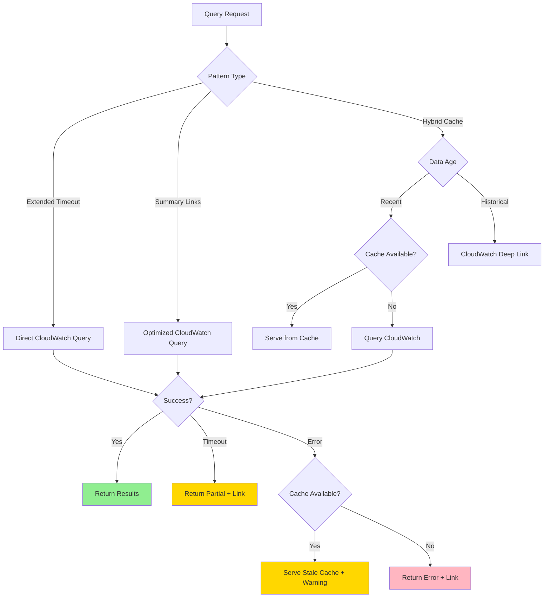

# Design Document: Observability Data Strategy

## Overview

The FAST Agent Gallery observability dashboard currently queries CloudWatch Logs directly via the FilterLogEvents API, which times out when querying 7+ days of data due to Lambda's 30-second timeout. This design introduces a configurable multi-pattern architecture that allows deployments to choose the observability strategy that best fits their needs.

### Design Philosophy

Rather than forcing a single approach, this design supports multiple configurable observability patterns following the existing agent configuration model in this repository. Different teams have different needs:

- Small teams with lightweight prototypes need simple solutions
- Power users want quick navigation to CloudWatch's advanced features
- High-volume teams need fast queries and complex filtering
- Balanced teams want good performance for recent data without full persistence costs

### Key Design Decisions

1. **Configuration-Driven Architecture**: Observability pattern is specified in `config.yaml` under a new `observability` section, similar to how `backend.pattern` configures agent deployment
2. **CloudWatch as System of Record**: All patterns treat CloudWatch Logs as the authoritative source of truth
3. **Incremental Implementation**: Start with one pattern (Approach 4: Summary + Deep Links), design for extensibility
4. **Deep Linking First-Class**: All patterns provide CloudWatch deep links for advanced analysis
5. **Backward Compatibility**: Default configuration maintains current behavior with improved timeout handling

## Architecture

### High-Level Architecture

```mermaid
graph TB
    subgraph "Frontend"
        UI[Observability Dashboard]
    end
    
    subgraph "API Gateway"
        API[/observability/sessions]
    end
    
    subgraph "Lambda Handler"
        Router[Pattern Router]
        P1[Pattern 1: Extended Timeout]
        P4[Pattern 4: Summary + Links]
        P5[Pattern 5: Hybrid Cache]
    end
    
    subgraph "Data Sources"
        CW[CloudWatch Logs<br/>aws/spans]
        DDB[(DynamoDB<br/>Session Cache)]
        S3[(S3<br/>Historical Archive)]
    end
    
    subgraph "Configuration"
        Config[config.yaml<br/>observability.pattern]
    end
    
    UI -->|GET /sessions| API
    API --> Router
    Config -.->|Deploy Time| Router
    Router -->|pattern=extended-timeout| P1
    Router -->|pattern=summary-links| P4
    Router -->|pattern=hybrid-cache| P5
    
    P1 -->|FilterLogEvents| CW
    P4 -->|FilterLogEvents<br/>Limited| CW
    P5 -->|Recent: Cache<br/>Historical: CW| DDB
    P5 --> CW
    
    style Config fill:#e1f5ff
    style CW fill:#fff4e6
    style DDB fill:#f3e5f5
    style S3 fill:#f3e5f5

```

### Configuration Schema

The observability pattern is configured in `config.yaml`:

```yaml
stack_name_base: my-stack

backend:
  pattern: strands-single-agent
  deployment_type: docker

# New observability configuration section
observability:
  pattern: summary-links  # Options: extended-timeout, summary-links, hybrid-cache
  
  # Pattern-specific configuration (optional, has defaults)
  config:
    # For extended-timeout pattern
    lambda_timeout_seconds: 60  # Default: 60, Max: 900
    
    # For hybrid-cache pattern
    cache_ttl_hours: 24  # Default: 24
    cache_table_name: null  # Default: {stack_name_base}-observability-cache
    
    # For all patterns
    max_sessions_per_query: 100  # Default: 100
    cloudwatch_retention_days: 7  # Default: 7 (must match CloudWatch config)
```

### Pattern Descriptions

#### Pattern 1: Extended Timeout (`extended-timeout`)

**Use Case**: Small teams with low query volumes, quick fix for current timeout issue

**How It Works**:
- Increases Lambda timeout from 30s to 60s (configurable up to 900s)
- Maintains current FilterLogEvents approach
- No infrastructure changes beyond Lambda configuration

**Pros**:
- Simplest implementation (configuration change only)
- No new infrastructure
- No data synchronization concerns

**Cons**:
- Doesn't fundamentally solve scalability
- Higher costs for long-running queries
- May still timeout on 30+ days with high volume

**Infrastructure**: None (Lambda timeout configuration only)

#### Pattern 4: Summary + Deep Links (`summary-links`)

**Use Case**: Teams that primarily need overview data with occasional deep dives into CloudWatch

**How It Works**:
- Lambda queries CloudWatch for session summaries only (minimal span data)
- Aggregates: sessionId, agentName, startTime, duration, status, spanCount
- Provides CloudWatch deep links for detailed trace analysis
- Limits query scope to prevent timeouts (e.g., max 7 days, pagination)

**Pros**:
- Fast queries for common use case (recent session list)
- Leverages CloudWatch for detailed analysis
- Clear separation of concerns (FAST = overview, CloudWatch = deep dive)
- No data duplication or sync complexity

**Cons**:
- Limited detail in FAST UI
- Requires users to navigate to CloudWatch for traces
- Still queries CloudWatch (but with smaller scope)

**Infrastructure**: None (Lambda logic changes only)

#### Pattern 5: Hybrid Cache (`hybrid-cache`)

**Use Case**: Balanced teams wanting fast queries for recent data without full persistence costs

**How It Works**:
- DynamoDB table caches recent session data (default: last 24 hours)
- Lambda serves recent queries from cache (fast)
- Historical queries (>24 hours) redirect to CloudWatch with deep links
- EventBridge rule triggers Lambda to populate cache from CloudWatch periodically
- TTL automatically expires old cache entries

**Pros**:
- Fast queries for common case (recent data)
- Reduced CloudWatch query costs
- Automatic cache management via TTL
- Falls back to CloudWatch for historical data

**Cons**:
- Additional infrastructure (DynamoDB, EventBridge)
- Cache synchronization delay (up to 5 minutes)
- Storage costs for DynamoDB

**Infrastructure**:
- DynamoDB table with TTL
- EventBridge rule for cache population
- Lambda function for cache sync

## Components and Interfaces

### Lambda Handler Interface

The observability-sessions Lambda handler implements a pattern router that selects the appropriate query strategy based on deployment configuration.

```python
# infra-cdk/lambdas/observability-sessions/index.py

from typing import Dict, Any, Protocol
from abc import ABC, abstractmethod

class ObservabilityPattern(ABC):
    """Base class for observability query patterns."""
    
    @abstractmethod
    def query_sessions(
        self,
        start_time_ms: int,
        end_time_ms: int,
        agent_name: Optional[str] = None,
        limit: int = 100,
        next_token: Optional[str] = None
    ) -> Dict[str, Any]:
        """
        Query sessions based on pattern-specific strategy.
        
        Returns:
            {
                "sessions": List[SessionSummary],
                "count": int,
                "nextToken": Optional[str],
                "dataSource": str,  # "cloudwatch", "cache", "hybrid"
                "cloudwatchLink": Optional[str]  # Deep link for detailed analysis
            }
        """
        pass

class ExtendedTimeoutPattern(ObservabilityPattern):
    """Pattern 1: Extended Lambda timeout with direct CloudWatch queries."""
    pass

class SummaryLinksPattern(ObservabilityPattern):
    """Pattern 4: Summary data with CloudWatch deep links."""
    pass

class HybridCachePattern(ObservabilityPattern):
    """Pattern 5: DynamoDB cache for recent data, CloudWatch for historical."""
    pass

def get_pattern(pattern_name: str) -> ObservabilityPattern:
    """Factory function to instantiate the configured pattern."""
    patterns = {
        "extended-timeout": ExtendedTimeoutPattern,
        "summary-links": SummaryLinksPattern,
        "hybrid-cache": HybridCachePattern,
    }
    return patterns[pattern_name]()

def handler(event: Dict[str, Any], context: Any) -> Dict[str, Any]:
    """Lambda handler with pattern routing."""
    pattern_name = os.environ.get("OBSERVABILITY_PATTERN", "summary-links")
    pattern = get_pattern(pattern_name)
    
    # Extract query parameters
    query_params = event.get("queryStringParameters") or {}
    start_time = int(query_params.get("startTime", default_start_time()))
    end_time = int(query_params.get("endTime", default_end_time()))
    agent_name = query_params.get("agentName")
    limit = int(query_params.get("limit", "100"))
    next_token = query_params.get("nextToken")
    
    # Execute pattern-specific query
    result = pattern.query_sessions(
        start_time_ms=start_time,
        end_time_ms=end_time,
        agent_name=agent_name,
        limit=limit,
        next_token=next_token
    )
    
    return {
        "statusCode": 200,
        "headers": get_cors_headers(event),
        "body": json.dumps(result)
    }
```

### CloudWatch Deep Link Generator

All patterns provide CloudWatch deep links for detailed analysis.

```python
# infra-cdk/lambdas/observability-sessions/cloudwatch_links.py

from typing import Optional
from urllib.parse import urlencode

def generate_cloudwatch_deep_link(
    region: str,
    log_group: str,
    start_time_ms: int,
    end_time_ms: int,
    filter_pattern: Optional[str] = None,
    session_id: Optional[str] = None
) -> str:
    """
    Generate CloudWatch Logs Insights deep link.
    
    Args:
        region: AWS region (e.g., "us-east-1")
        log_group: Log group name (e.g., "aws/spans")
        start_time_ms: Start time in milliseconds since epoch
        end_time_ms: End time in milliseconds since epoch
        filter_pattern: Optional CloudWatch filter pattern
        session_id: Optional session ID to filter by
    
    Returns:
        CloudWatch console URL with pre-configured query
    """
    # Build Logs Insights query
    query_parts = [
        "fields @timestamp, @message",
        f"| filter @logStream like /{log_group}/",
    ]
    
    if session_id:
        query_parts.append(f'| filter @message like /"{session_id}"/')
    
    if filter_pattern:
        query_parts.append(f"| filter {filter_pattern}")
    
    query_parts.extend([
        "| sort @timestamp desc",
        "| limit 1000"
    ])
    
    query = "\n".join(query_parts)
    
    # Construct CloudWatch console URL
    base_url = f"https://{region}.console.aws.amazon.com/cloudwatch/home"
    params = {
        "region": region,
        "#logsV2:logs-insights": {
            "queryDetail": {
                "queryString": query,
                "logGroupNames": [log_group],
                "startTime": start_time_ms,
                "endTime": end_time_ms
            }
        }
    }
    
    # URL encode the parameters
    encoded_params = urlencode(params)
    return f"{base_url}?{encoded_params}"
```

### Frontend API Response

The frontend receives a consistent response format regardless of pattern:

```typescript
// frontend/src/types/observability.ts

interface SessionSummary {
  sessionId: string;
  agentName: string;
  agentDisplayName: string;
  agentId: string | null;
  startTime: number;  // milliseconds since epoch
  endTime: number;
  duration: number;  // milliseconds
  status: "completed" | "failed" | "in-progress";
  spanCount: number;
}

interface SessionsResponse {
  sessions: SessionSummary[];
  count: number;
  nextToken?: string;
  dataSource: "cloudwatch" | "cache" | "hybrid";
  cloudwatchLink?: string;  // Deep link for detailed analysis
  cacheAge?: number;  // For cached data, age in seconds
}
```

## Data Models

### DynamoDB Schema (Pattern 5: Hybrid Cache)

```python
# Table: {stack_name_base}-observability-cache

{
  "sessionId": "orchestrator_7a289a85-c421-4520-8dcc-5c11121f133c",  # Partition Key
  "startTime": 1704067200000,  # Sort Key (milliseconds since epoch)
  "agentName": "orchestrator",
  "agentDisplayName": "Orchestrator Agent",
  "agentId": "marodon_fast_orchestrator-v3vPp178fn",
  "endTime": 1704067215000,
  "duration": 15000,
  "status": "completed",
  "spanCount": 42,
  "ttl": 1704153600,  # TTL in seconds since epoch (24 hours after startTime)
  "syncedAt": 1704067220000,  # When this record was synced from CloudWatch
  "spanSummary": {  # Optional: minimal span data for quick display
    "rootSpan": {
      "name": "POST /invocations http receive",
      "duration": 15000
    },
    "errorSpans": []  # List of span IDs with errors
  }
}

# Global Secondary Index: agentName-startTime-index
# Partition Key: agentName
# Sort Key: startTime
# Projection: ALL
```

### CloudWatch Logs Query Optimization

For Pattern 4 (Summary + Links), optimize queries to fetch minimal data:

```python
# Query strategy for session summaries
def query_session_summaries(start_time_ms: int, end_time_ms: int) -> List[SessionSummary]:
    """
    Optimized CloudWatch query that fetches only essential fields.
    
    Strategy:
    1. Query with time range filter (reduces scan scope)
    2. Parse only required fields from OTEL spans
    3. Group by session.id in memory (fast)
    4. Aggregate to session summaries (minimal data transfer)
    """
    
    # FilterLogEvents with time range
    response = logs_client.filter_log_events(
        logGroupName="aws/spans",
        startTime=start_time_ms,
        endTime=end_time_ms,
        limit=10000  # CloudWatch max
    )
    
    # Parse minimal fields
    sessions = defaultdict(lambda: {
        "spans": [],
        "firstTimestamp": float('inf'),
        "lastTimestamp": 0,
        "hasError": False
    })
    
    for event in response["events"]:
        span = parse_minimal_span(event)  # Only extract: sessionId, timestamp, errorType
        session_id = span["sessionId"]
        
        sessions[session_id]["spans"].append(span)
        sessions[session_id]["firstTimestamp"] = min(
            sessions[session_id]["firstTimestamp"],
            span["timestamp"]
        )
        sessions[session_id]["lastTimestamp"] = max(
            sessions[session_id]["lastTimestamp"],
            span["timestamp"]
        )
        if span.get("errorType"):
            sessions[session_id]["hasError"] = True
    
    # Build summaries
    summaries = []
    for session_id, data in sessions.items():
        summaries.append({
            "sessionId": session_id,
            "agentName": extract_agent_name_from_session_id(session_id),
            "startTime": data["firstTimestamp"],
            "endTime": data["lastTimestamp"],
            "duration": data["lastTimestamp"] - data["firstTimestamp"],
            "status": "failed" if data["hasError"] else "completed",
            "spanCount": len(data["spans"])
        })
    
    return summaries
```

## Correctness Properties

*A property is a characteristic or behavior that should hold true across all valid executions of a system-essentially, a formal statement about what the system should do. Properties serve as the bridge between human-readable specifications and machine-verifiable correctness guarantees.*


### Property 1: Query Performance Scales with Time Range

*For any* time range and data volume, when querying sessions, the response time should scale predictably: 24-hour queries complete within 5 seconds, 7-day queries within 10 seconds, and 30-day queries within 15 seconds (or return pagination token), with performance degrading by no more than 2x when data volume increases by 10x.

**Validates: Requirements 1.1, 1.2, 1.3, 2.1, 9.1**

### Property 2: High-Volume Agent Support

*For any* agent generating 1000+ spans per day, the system should successfully query and aggregate session data, and support querying at least 5 agents simultaneously without performance degradation.

**Validates: Requirements 2.2, 2.3**

### Property 3: CloudWatch Data Immutability

*For any* observability operation, the system should never delete or modify span data in CloudWatch Logs, ensuring CloudWatch remains the immutable system of record.

**Validates: Requirements 3.1, 3.5**

### Property 4: Cache Synchronization Timeliness

*For any* pattern that persists data locally (DynamoDB/S3), when new spans are created in CloudWatch, the local cache should synchronize within 5 minutes, and the API should indicate data freshness in responses.

**Validates: Requirements 3.2, 3.3**

### Property 5: Deep Link Correctness

*For any* session or agent query, the system should generate CloudWatch deep links that navigate to the correct log group (aws/spans), include the session's time range as filters, and include filter patterns that isolate the specific session's or agent's spans.

**Validates: Requirements 4.1, 4.2, 4.3, 4.4**

### Property 6: Session Summary Completeness

*For any* session, the session summary should contain all key metrics (sessionId, agentName, startTime, endTime, duration, status, spanCount) without requiring full span details to be loaded.

**Validates: Requirements 5.3, 10.3**

### Property 7: Cache Hit Optimization

*For any* query for recent data (within cache threshold), if cached data exists and is less than 1 minute old, the system should serve from cache without querying CloudWatch, minimizing redundant queries.

**Validates: Requirements 6.1, 6.4, 11.2**

### Property 8: Pagination Consistency

*For any* query that returns more results than the limit, the system should return a pagination token, and using that token should fetch the next page of results without duplicates or gaps.

**Validates: Requirements 6.3, 9.3**

### Property 9: Cost Monitoring

*For any* CloudWatch Logs query operation, the system should emit metrics tracking query costs, enabling cost monitoring and optimization.

**Validates: Requirements 6.5**

### Property 10: Session Detail Hierarchy Preservation

*For any* session with multiple spans, when fetching session details, the system should preserve span hierarchy (parent-child relationships) and timing information, using session ID filtering to minimize data transfer.

**Validates: Requirements 7.1, 7.2, 7.4**

### Property 11: Retention Period Alignment

*For any* pattern that persists data locally, the local retention period (TTL) should match the CloudWatch Logs retention period, and the API should return retention metadata for UI display.

**Validates: Requirements 8.2, 8.4**

### Property 12: Error Handling with Fallback Links

*For any* query that times out or fails, the error response should include a descriptive error message with the specific time range that failed, and provide a CloudWatch deep link as a fallback option.

**Validates: Requirements 1.4, 5.4, 12.1, 12.2**

### Property 13: Stale Cache Fallback

*For any* query when CloudWatch is unavailable, if local cache exists, the system should serve cached data with a staleness warning, ensuring some level of service during outages.

**Validates: Requirements 12.4**

### Property 14: Query Failure Logging

*For any* query failure, the system should log the failure with sufficient context (time range, agent filter, error type, pattern used) for debugging.

**Validates: Requirements 12.5**

### Property 15: Pattern Configuration Routing

*For any* configured observability pattern, the Lambda handler should route queries to the correct pattern implementation, and automatically provision required infrastructure (DynamoDB, EventBridge) based on the pattern.

**Validates: Requirements 13.1, 13.3, 13.5**

### Property 16: Historical Data Fallback

*For any* hybrid-cache pattern query for historical data beyond the cache threshold, the system should provide CloudWatch deep links instead of attempting to cache all historical data.

**Validates: Requirements 2.4, 11.3**

### Property 17: Automatic Cache Population

*For any* hybrid-cache pattern deployment, the system should automatically populate the cache with new span data as it arrives in CloudWatch Logs, without manual intervention.

**Validates: Requirements 11.4**

### Property 18: Large Session Handling

*For any* session with more than 100 spans, the system should either paginate the span details or provide a "View in CloudWatch" option to prevent overwhelming the UI.

**Validates: Requirements 7.5**

## Error Handling

### Error Categories

1. **Query Timeout Errors**
   - Cause: Time range too large, data volume too high
   - Response: HTTP 200 with partial results + CloudWatch deep link
   - User Action: Use CloudWatch for detailed analysis or reduce time range

2. **CloudWatch Service Errors**
   - Cause: CloudWatch Logs API unavailable or throttled
   - Response: HTTP 503 with retry-after header
   - Fallback: Serve stale cache if available (hybrid-cache pattern)
   - User Action: Wait and retry, or use cached data

3. **Configuration Errors**
   - Cause: Invalid observability pattern in config.yaml
   - Response: CDK deployment failure with clear error message
   - User Action: Fix configuration and redeploy

4. **Cache Synchronization Errors**
   - Cause: DynamoDB unavailable, EventBridge rule failure
   - Response: Log error, continue serving from CloudWatch
   - Fallback: Degrade to direct CloudWatch queries
   - User Action: None (automatic fallback)

5. **Data Retention Errors**
   - Cause: Query for data older than retention period
   - Response: HTTP 200 with empty results + message about retention
   - User Action: Adjust time range to within retention period

### Error Response Format

```json
{
  "error": "QueryTimeout",
  "message": "Query for 30-day time range exceeded timeout. Try a shorter range or use CloudWatch for historical analysis.",
  "timeRange": {
    "startTime": 1704067200000,
    "endTime": 1706745600000,
    "durationDays": 31
  },
  "cloudwatchLink": "https://us-east-1.console.aws.amazon.com/cloudwatch/...",
  "suggestions": [
    "Reduce time range to 7 days or less",
    "Use CloudWatch Logs Insights for complex queries",
    "Filter by specific agent to reduce data volume"
  ]
}
```

### Graceful Degradation Strategy



## Testing Strategy

### Dual Testing Approach

This feature requires both unit tests and property-based tests for comprehensive coverage:

- **Unit tests**: Verify specific examples, edge cases, error conditions, and integration points
- **Property tests**: Verify universal properties across all inputs through randomization

### Unit Testing Focus

Unit tests should cover:

1. **Configuration Loading**
   - Valid config.yaml patterns load correctly
   - Invalid patterns fail with clear errors
   - Default pattern is applied when not specified

2. **Pattern Routing**
   - Correct pattern class is instantiated based on config
   - Pattern-specific environment variables are set
   - Infrastructure is provisioned for pattern requirements

3. **Deep Link Generation**
   - URLs are correctly formatted
   - Time ranges are properly encoded
   - Session ID filters are included
   - Agent filters are included

4. **Error Handling**
   - Timeout errors include CloudWatch links
   - Service errors trigger fallback to cache
   - Configuration errors fail deployment
   - Retention errors return appropriate messages

5. **Cache Operations (Hybrid Pattern)**
   - Cache hit returns cached data
   - Cache miss queries CloudWatch
   - TTL is correctly set
   - Sync function populates cache

### Property-Based Testing Configuration

Use **Hypothesis** (Python) for property-based testing with minimum 100 iterations per test.

Each property test must reference its design document property using this tag format:
```python
# Feature: observability-data-strategy, Property 1: Query Performance Scales with Time Range
```

### Property Test Examples

```python
# Feature: observability-data-strategy, Property 1: Query Performance Scales with Time Range
@given(
    time_range_hours=st.integers(min_value=1, max_value=720),
    span_count=st.integers(min_value=0, max_value=10000)
)
@settings(max_examples=100)
def test_query_performance_scales_with_time_range(time_range_hours, span_count):
    """
    Property: Query performance should scale predictably with time range.
    
    For any time range and data volume, response times should meet SLAs:
    - 24 hours: <= 5 seconds
    - 7 days: <= 10 seconds
    - 30 days: <= 15 seconds (or pagination token)
    """
    # Generate random session data
    sessions = generate_random_sessions(span_count, time_range_hours)
    
    # Query sessions
    start_time = time.time()
    result = query_sessions(
        start_time_ms=sessions[0]["startTime"],
        end_time_ms=sessions[-1]["endTime"]
    )
    elapsed = time.time() - start_time
    
    # Verify performance SLA
    if time_range_hours <= 24:
        assert elapsed <= 5.0, f"24-hour query took {elapsed}s, expected <=5s"
    elif time_range_hours <= 168:  # 7 days
        assert elapsed <= 10.0, f"7-day query took {elapsed}s, expected <=10s"
    elif time_range_hours <= 720:  # 30 days
        assert elapsed <= 15.0 or result.get("nextToken"), \
            f"30-day query took {elapsed}s without pagination, expected <=15s or token"


# Feature: observability-data-strategy, Property 5: Deep Link Correctness
@given(
    session_id=st.text(min_size=10, max_size=100),
    start_time_ms=st.integers(min_value=1704067200000, max_value=1735689600000),
    end_time_ms=st.integers(min_value=1704067200000, max_value=1735689600000)
)
@settings(max_examples=100)
def test_deep_link_correctness(session_id, start_time_ms, end_time_ms):
    """
    Property: Deep links should always navigate to correct log group with proper filters.
    
    For any session, the generated CloudWatch link should:
    - Point to aws/spans log group
    - Include session time range
    - Include session ID filter
    """
    # Ensure end_time >= start_time
    if end_time_ms < start_time_ms:
        start_time_ms, end_time_ms = end_time_ms, start_time_ms
    
    # Generate deep link
    link = generate_cloudwatch_deep_link(
        region="us-east-1",
        log_group="aws/spans",
        start_time_ms=start_time_ms,
        end_time_ms=end_time_ms,
        session_id=session_id
    )
    
    # Parse and verify link components
    assert "aws/spans" in link, "Link should reference aws/spans log group"
    assert str(start_time_ms) in link, "Link should include start time"
    assert str(end_time_ms) in link, "Link should include end time"
    assert session_id in link, "Link should include session ID filter"
    assert link.startswith("https://"), "Link should be valid HTTPS URL"


# Feature: observability-data-strategy, Property 8: Pagination Consistency
@given(
    total_sessions=st.integers(min_value=50, max_value=500),
    page_size=st.integers(min_value=10, max_value=100)
)
@settings(max_examples=100)
def test_pagination_consistency(total_sessions, page_size):
    """
    Property: Pagination should return all results without duplicates or gaps.
    
    For any query with pagination, fetching all pages should:
    - Return all sessions exactly once
    - Maintain sort order
    - Have no duplicates or gaps
    """
    # Generate random sessions
    all_sessions = generate_random_sessions(total_sessions)
    
    # Fetch all pages
    fetched_sessions = []
    next_token = None
    
    while True:
        result = query_sessions(limit=page_size, next_token=next_token)
        fetched_sessions.extend(result["sessions"])
        next_token = result.get("nextToken")
        
        if not next_token:
            break
    
    # Verify completeness
    assert len(fetched_sessions) == total_sessions, \
        f"Expected {total_sessions} sessions, got {len(fetched_sessions)}"
    
    # Verify no duplicates
    session_ids = [s["sessionId"] for s in fetched_sessions]
    assert len(session_ids) == len(set(session_ids)), "Pagination returned duplicates"
    
    # Verify sort order maintained (newest first)
    start_times = [s["startTime"] for s in fetched_sessions]
    assert start_times == sorted(start_times, reverse=True), \
        "Pagination broke sort order"


# Feature: observability-data-strategy, Property 15: Pattern Configuration Routing
@given(
    pattern=st.sampled_from(["extended-timeout", "summary-links", "hybrid-cache"])
)
@settings(max_examples=100)
def test_pattern_configuration_routing(pattern):
    """
    Property: Pattern configuration should route to correct implementation.
    
    For any valid pattern configuration, the system should:
    - Instantiate the correct pattern class
    - Provision required infrastructure
    - Execute pattern-specific query logic
    """
    # Set pattern in environment
    os.environ["OBSERVABILITY_PATTERN"] = pattern
    
    # Get pattern instance
    pattern_instance = get_pattern(pattern)
    
    # Verify correct class
    expected_classes = {
        "extended-timeout": ExtendedTimeoutPattern,
        "summary-links": SummaryLinksPattern,
        "hybrid-cache": HybridCachePattern
    }
    assert isinstance(pattern_instance, expected_classes[pattern]), \
        f"Pattern {pattern} should instantiate {expected_classes[pattern].__name__}"
    
    # Verify pattern-specific behavior
    result = pattern_instance.query_sessions(
        start_time_ms=int(time.time() * 1000) - 86400000,  # Last 24 hours
        end_time_ms=int(time.time() * 1000)
    )
    
    # All patterns should return consistent interface
    assert "sessions" in result
    assert "count" in result
    assert "dataSource" in result
    assert "cloudwatchLink" in result
```

### Integration Testing

Integration tests should verify:

1. **End-to-End Query Flow**
   - API Gateway → Lambda → CloudWatch → Response
   - Authentication with Cognito
   - CORS headers

2. **Pattern-Specific Infrastructure**
   - DynamoDB table exists for hybrid-cache pattern
   - EventBridge rule triggers cache sync
   - TTL expires old cache entries

3. **CDK Deployment**
   - Stack deploys successfully with each pattern
   - IAM permissions are correctly configured
   - SSM parameters are created

### Performance Testing

Performance tests should measure:

1. **Response Time SLAs**
   - 24-hour queries: p50 < 3s, p95 < 5s
   - 7-day queries: p50 < 7s, p95 < 10s
   - 30-day queries: p50 < 12s, p95 < 15s

2. **Scalability**
   - 10x data volume: response time < 2x baseline
   - 5 concurrent agents: no degradation

3. **Cache Performance (Hybrid Pattern)**
   - Cache hit: < 100ms
   - Cache miss: < 5s (CloudWatch query)

## Deployment and Migration Strategy

### Phase 1: Initial Implementation (Pattern 4: Summary + Links)

**Goal**: Solve immediate timeout issue with minimal infrastructure changes

**Steps**:
1. Add `observability` section to `config.yaml` schema
2. Implement pattern router in Lambda handler
3. Implement `SummaryLinksPattern` class
4. Implement CloudWatch deep link generator
5. Update CDK stack to read observability config
6. Deploy with default pattern: `summary-links`

**Timeline**: 1-2 weeks

**Risk**: Low (no new infrastructure, backward compatible)

### Phase 2: Extended Timeout Pattern (Pattern 1)

**Goal**: Provide simple option for low-volume deployments

**Steps**:
1. Implement `ExtendedTimeoutPattern` class
2. Add Lambda timeout configuration to CDK
3. Document trade-offs in README

**Timeline**: 1 week

**Risk**: Low (configuration only)

### Phase 3: Hybrid Cache Pattern (Pattern 5)

**Goal**: Provide high-performance option for high-volume deployments

**Steps**:
1. Design DynamoDB schema with TTL
2. Implement `HybridCachePattern` class
3. Create EventBridge rule for cache sync
4. Implement cache sync Lambda function
5. Update CDK stack to provision DynamoDB + EventBridge
6. Add cache monitoring metrics

**Timeline**: 3-4 weeks

**Risk**: Medium (new infrastructure, sync complexity)

### Migration Path

**Existing Deployments**:
- Default to `summary-links` pattern (maintains current behavior with improvements)
- No breaking changes to API contract
- Frontend receives same response format

**Opting Into New Patterns**:
1. Update `config.yaml` with desired pattern
2. Run `cdk deploy` (provisions new infrastructure if needed)
3. Test with small time ranges first
4. Gradually increase time ranges to verify performance

**Rollback Strategy**:
- Change `observability.pattern` back to `summary-links`
- Redeploy CDK stack
- DynamoDB table can be retained or deleted (no data loss, CloudWatch is source of truth)

### Configuration Examples

**Minimal Configuration (Default)**:
```yaml
stack_name_base: my-stack
backend:
  pattern: strands-single-agent

# Observability defaults to summary-links pattern
```

**Extended Timeout Pattern**:
```yaml
stack_name_base: my-stack
backend:
  pattern: strands-single-agent

observability:
  pattern: extended-timeout
  config:
    lambda_timeout_seconds: 90  # Increase from default 60s
```

**Hybrid Cache Pattern**:
```yaml
stack_name_base: my-stack
backend:
  pattern: strands-single-agent

observability:
  pattern: hybrid-cache
  config:
    cache_ttl_hours: 48  # Cache last 48 hours instead of default 24
    max_sessions_per_query: 200  # Increase page size
```

## Recommended Implementation Order

Based on the requirements analysis and design trade-offs, the recommended implementation order is:

### 1. Pattern 4: Summary + Links (FIRST)

**Rationale**:
- Solves immediate timeout issue
- No new infrastructure (lowest risk)
- Provides CloudWatch deep links (high value)
- Fast queries for common use case (recent sessions)
- Foundation for other patterns

**Effort**: Low (1-2 weeks)

**Value**: High (solves core problem)

### 2. Pattern 1: Extended Timeout (SECOND)

**Rationale**:
- Simple option for low-volume teams
- Configuration-only change
- Complements Pattern 4 for teams that prefer direct queries

**Effort**: Very Low (1 week)

**Value**: Medium (niche use case)

### 3. Pattern 5: Hybrid Cache (THIRD)

**Rationale**:
- High-performance option for production deployments
- Requires most infrastructure and complexity
- Build on lessons learned from Patterns 1 and 4

**Effort**: High (3-4 weeks)

**Value**: High (for high-volume deployments)

### Patterns NOT Recommended for Initial Implementation

**Pattern 2: Full Persistence (DynamoDB/S3)**:
- High complexity (sync, consistency, storage costs)
- Duplicates CloudWatch data unnecessarily
- Pattern 5 (Hybrid) provides most benefits with less complexity

**Pattern 3: Persist Links Only**:
- Doesn't solve timeout issue
- Limited value over Pattern 4
- Pattern 4 provides same deep linking with better UX

## Future Enhancements

### Post-Initial Implementation

1. **CloudWatch Logs Insights Integration**
   - Use Logs Insights API instead of FilterLogEvents for complex queries
   - Better performance for large time ranges
   - More powerful query capabilities

2. **Session Detail Caching**
   - Cache full span details for recently viewed sessions
   - Reduce repeated CloudWatch queries for same session
   - Implement in-memory Lambda cache or ElastiCache

3. **Metrics Dashboard**
   - Visualize query performance metrics
   - Track cache hit rates (hybrid pattern)
   - Monitor CloudWatch query costs

4. **Advanced Filtering**
   - Filter by status (completed, failed)
   - Filter by duration range
   - Filter by span count
   - Full-text search in span names

5. **Export Functionality**
   - Export sessions to CSV/JSON
   - Generate reports for time ranges
   - Integrate with S3 for long-term storage

6. **Real-Time Updates**
   - WebSocket connection for live session updates
   - Push notifications for new sessions
   - Auto-refresh dashboard

## Appendix: Pattern Comparison Matrix

| Criterion | Extended Timeout | Summary + Links | Hybrid Cache |
|-----------|-----------------|-----------------|--------------|
| **Implementation Complexity** | Very Low | Low | High |
| **Infrastructure Cost** | Low | Low | Medium |
| **Query Performance (24h)** | Good (3-5s) | Excellent (<2s) | Excellent (<1s) |
| **Query Performance (7d)** | Fair (8-10s) | Good (5-7s) | Good (cache miss: 5-7s) |
| **Query Performance (30d)** | Poor (timeout risk) | Fair (pagination) | Fair (CloudWatch redirect) |
| **Scalability** | Poor | Good | Excellent |
| **Data Freshness** | Real-time | Real-time | 5-minute delay |
| **CloudWatch Dependency** | High | High | Medium |
| **Maintenance Burden** | Very Low | Low | Medium |
| **Best For** | Small teams, prototypes | Most teams, balanced needs | High-volume production |
| **Worst For** | High-volume, long time ranges | Teams needing full detail in FAST | Small teams, simple needs |

## Conclusion

This design provides a flexible, configurable observability architecture that solves the immediate timeout issue while supporting future scalability needs. By implementing Pattern 4 (Summary + Links) first, we deliver immediate value with minimal risk, then incrementally add more sophisticated patterns as needed.

The pattern-based approach follows existing repository conventions (similar to `backend.pattern`), making it familiar to users and maintainable for developers. Each pattern has clear trade-offs documented, allowing teams to choose the approach that best fits their needs.
